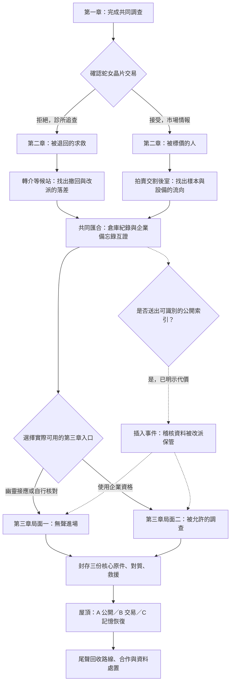

# NEON MEMORIES｜跨章分流製作規劃

> 製作狀態更新：第一批已完成製作與驗收。第二、三批仍待製作；以下原始規劃不代表全部已完成。實際交付見 `chapter_branches_completed_2026_09_09.md`。

日期：2026-09-09。**狀態：提案，尚未實作。** 本輪只規劃與同步文件，沒有改寫遊戲、生成素材或執行通關測試。現況仍以 [目前劇情架構圖](./story_structure_2026_09_09.md) 為準。

## 目標與本次範圍

讓第一章的做法改變第二章「查什麼、跟誰查、如何拿到線索」，讓第二章留下的身份與合作關係改變第三章「如何接近設備、如何保存資料、如何準備撤離」。保留三章與 A／B／C 主結局。

首版做 **第二章兩條主要調查線 × 第三章兩種調查局面**，另加一個可插入兩種局面的資料暴露事件。不是四套完整遊戲，也不只換台詞。每條第二章路線要有一張專屬地圖、三個事件、一種判讀方式及至少兩個後續回應。

目前已有蛇女交易、幽靈保護／出賣／補救、三種總部入口、備份／照護和結局細節。下文是在這些現成內容上延伸，不把已完成的事件重算為新增。

## 一、跨章架構

圖中所有新增節點均為提案。第一章路線不綁定第三章局面：醫療線也能後來使用企業身份，市場線也能放棄捷徑改由幽靈或自行進入。

## 二、第一章如何決定路線

沿用 `chapter_1_route_chosen` 的 `clinic`／`black_market`。它應由現有明確交易選擇決定，不從好感度、鷹眼次數、讀取順序或模糊善惡分數猜測。

| 第一章操作 | 第二章開場 | 玩家在離章前應知道的事情 |
|---|---|---|
| 拒絕晶片交易，選診所與義眼追查 | Dr. 陳聯絡網咖，提供一個離線轉介窗口；小鬼協助查接收代碼 | 先查人的去向，需要比對退件與接收紀錄；不會獲得蛇女的拍賣引介 |
| 交出晶片副本換情報 | 蛇女留下交割引介，小鬼核對可使用的身份 | 先查商品與設備流向；交出的副本已形成責任，後來換路也不能撤銷歷史 |

第一章仍完成原有推理後才離章。美玲信任與家庭資料的處置影響她願意補充多少，**不另設隱藏信任門檻阻止醫療線開始**。

第二章以網咖為共同開場與聯絡點，不讓玩家返回第一章的診所。新醫療地點是另一處轉介等候站。

### 換路規則

- 在第二章專屬路線的第三個事件完成前，可於網咖改變追查方向。確認畫面說明會失去哪次當晚的窗口／交割機會；不是按下對話後才告知。
- 醫療轉市場：取得一張用途受限、留有使用紀錄的引介，不要求被迫出售家庭記憶；原先拒絕蛇女的紀錄不改成接受。引介只進交割後室，不自動取得第三章企業通行權。
- 市場轉醫療：停用尚可使用的市場引介、向美玲交代已交出的副本；她可以仍然生氣。這不是刪除既有交易或自動修復信任。
- 路線第三事件完成時固定本章主要調查結果：另一邊當晚的專屬時段已過，仍能做原有共通地圖調查。無隱藏倒數；只是章節節點結算。
- 換路不退還已消耗的移動行動點，不重發證據或掃描獎勵；能量不足可休息充能，不因此錯失時段。

## 三、第二章 A 線：被退回的求救

**核心問題：浩然明明留下了拒絕與求助，為什麼仍被送往實驗室？**

主要人物：Dr. 陳、小鬼、美玲；既有市政檔案室與倉庫參與核對。新地圖「離線轉介等候站」連接網咖與市政檔案室。

| 事件暫名 | 玩家實際做什麼 | 揭露與代價 | 後續用途 |
|---|---|---|---|
| A1 沒有被叫到的號碼 | 在等候站比對叫號紙、離線接收簿和轉介時間；選擇哪些是同一案件 | 系統顯示已轉介，不代表有人真的接手；不能把多次退件算成多名受害者 | 取得匿名流程定位，不憑一個號碼認定就是浩然 |
| A2 被改派的床位 | 回市政檔案室，將既有 R-17 回執與等候站紀錄交叉核對 | 原訂獨立接收站被改派到企業端。R-17 仍是匿名另一案例；其流程缺陷不能直接當浩然的身份證據 | 開放一組可追問的改派依據，供第三章照護與責任對質使用 |
| A3 先替誰留住窗口 | 以浩然日記／已有受害者清單核對他的接收代碼，再決定先確認浩然接收，或先封存整批改派紀錄 | 前者先得到具名接收回覆但批次核對較慢；後者保住流程材料但照護暫由既有離線安排承接。兩者都不憑空宣稱救出其他病人 | 接到倉庫共同調查；第三章接收準備和尾聲回覆不同 |

**這條線的調查特色：** 用多份互相推託的紀錄重建求助過程，問的是「誰應接手卻沒有接手」。錯誤配對會指出不合的時間／代碼，允許重查，不扣隱藏生命值。

既有檔案室退件索引與回執掃描保留，A2 擴充其用途，不再複製一套同義掃描。醫療線不因比較有人情味就沒有代價：它取得見證較慢，也可能錯過運輸現場。

## 四、第二章 B 線：被標價的人

**核心問題：供應鏈如何把某個人的生活，包裝成能交割的樣本？**

主要人物：蛇女、面具商人、幽靈、小鬼。新地圖「拍賣交割後室」連接記憶黑市與下水道通道。

| 事件暫名 | 玩家實際做什麼 | 揭露與代價 | 後續用途 |
|---|---|---|---|
| B1 樣本沒有名字 | 在後室核對展示批號、設備封條及交割時間，找出重新包裝的同批貨 | 標為全新來源的樣本，與舊維護批號重合；商品名稱不能直接指認受害者 | 取得供應鏈調查方向，接到倉庫批號 |
| B2 借來的買家席位 | 選擇使用可追蹤的引介查完整交割表，或留在公共交接區核對較少欄位 | 前者資料較完整但留下本人使用紀錄；後者需要幽靈／公開封條交叉補足，不是自動失敗 | 第三章有人認出凱的交易足跡，或需要額外核對派送節點 |
| B3 貨先走，還是帳先留 | 先保住完整批次帳目，或先記下當晚設備去向 | 保帳時可能失去現場跟車機會；追運輸時只有可驗證的局部帳目。安全使用離線記錄，不加入追車戰鬥系統 | 匯入倉庫調查；第三章稽核核對起點與設備位置提示不同 |

**這條線的調查特色：** 比較包裝、來源與交割，問的是「貨物被換了什麼名稱，又被送給誰」。不要求玩家讀取或出售私人記憶才能前進。

幽靈原有保護／出賣／補救照常可做，B2 的引介不覆蓋它，也不直接賦予企業入口。既有購買／侵入／拒絕樣本和市場追討權各有自己的歷史，不能混成一個交易結果。

## 五、第二章如何匯合

兩條路線都能取得**可指向倉庫與企業端的調查理由**。A1／A2 或 B1／B2 之間允許穿插既有共通調查；先從幽靈等既有線索取得倉庫位置，取得日記與受害者清單後再完成 A3／B3，最後核對企業備忘錄。醫療線仍可造訪黑市，不以路線名稱封掉共通證據來源。路線材料是查案入口，不是取代第三章原件的新捷徑。

新版新遊戲需要完成所選路線的 A3 或 B3，才開放第二章「確認總部路線」。原有共通地圖仍可探索，但提前取得倉庫資料不應略過整條新增路線。製作時必須同步檢查目前會自動給出倉庫位置與進度的進場對話。

離開第二章前列出三件具體狀態：目前可用的總部入口、未完成的幽靈約定、是否已送出可識別資料。玩家明確確認離章，不把多走一次地圖當作自動結算。

## 六、第三章的兩種局面

仍用既有 `hq_entry_route`：`ghost`、`corporate`、`independent`。不用再複製一個可能與它矛盾的「第三章路線」欄位。

| 局面 | 形成條件 | 新增兩個事件 | 主要困難 |
|---|---|---|---|
| 無聲進場 | 幽靈接應或自行核對入口 | ① 核對離線維修窗口，決定先確認撤離線或查稽核架；② 找到設備與資料的實際交接位置，完成離線保管 | 幽靈線有有限接應，自行線需多做一次維修表判讀；都不能把未保護的幽靈寫成自動來救人 |
| 被允許的調查 | 使用仍有效的企業資格 | ① 趙明透過終端提醒可見範圍，玩家辨認展示摘要與正式稽核紀錄；② 決定留下具名調閱紀錄取得核驗，或停用企業資格轉做離線查證 | 方便進門，但每次正式查閱留下紀錄；拒絕展示版本後仍有可查證的替代流程 |

兩邊都回到現有的核心原件封存、蕭博士對質與浩然救援。改變的是前面的事件順序、資料取得過程和角色反應；不把浩然存活交給沒有預告的隱藏倒數。

企業資格停用後，原本使用過的 `hq_entry_route` 不改寫，公開紀錄仍保留；只記錄「資格已停用」供後續事件用。這是局面內的處理，不重跑另一套完整第三章開場。

醫療線材料可追問接收與撤回程序；市場線材料可追問設備與交割。兩邊都可補足現有三份核心證據，A／B／C 不因出生路線永久關閉。

## 七、共通插入事件：有人先搬走了資料

**觸發必須明確。** 在第二章新增一次情報處置選擇：保留完整索引離線、只送去識別警示、或把可識別完整索引送到公開節點。第三個選項先說明「對方可能識別查詢來源，改派資料保管；相關人員也可能被辨認」，確認後才記錄暴露。

不把現有去識別出貨提醒、向美玲報平安或最終合法舉報誤算成打草驚蛇。玩家不需要故意暴露才能取得任何主結局。

| 項目 | 規劃 |
|---|---|
| 到第三章看見什麼 | 稽核架留下移交封條與新保管位置；不是只播放「警戒升高」一句話 |
| 秘密進場如何處理 | 比對移交時間、封條及維修通道，循新的保管記錄核對原件 |
| 企業入口如何處理 | 用調閱回條辨認誰批准改派，再核對新保管位置；受限者可轉離線查證 |
| 須保留的界線 | 不刪除玩家已取得證據、不用來歷不明副本取代原件、不把受害者搬走後永遠救不到 |
| 代價與回應 | 多一段可重試的核對；尾聲承認曾公開可識別索引，A 必須納入最新自述紀錄 |
| 如何避免重複觸發 | 同一次改派事件只結算一次；回查、存讀檔與地圖重訪不再收費或再搬一次 |

這不是鼓勵暴露的額外獎勵關卡。未暴露者在同一稽核位置核對正常保管鏈，仍有完整調查內容；暴露者面對的是替代保管鏈與具體後果。

## 八、人物變化與尾聲回收

| 人物 | 路線中要看見的變化 | 尾聲要回答的問題 |
|---|---|---|
| 美玲 | 是否被如實告知家庭資料已流出；提供自己知道的部分，不提供全知答案 | 她願不願意再把下一份家庭紀錄交給凱？不能因通關就一律原諒 |
| Dr. 陳 | 從解說技術變成願意留下接收責任紀錄的人 | 個別接收是否真的有人回覆，而非泛稱大家得救 |
| 蛇女 | 引介受到停用或限制時，仍要說清交易帳如何保留 | 本次入口結束後，還保留什麼權利？與原晶片交易分列 |
| 幽靈 | 有協助範圍、也有拒絕的權利 | 接應結束是否能離開；補救不抹掉身份外流 |
| 趙明 | 必須選擇提供能驗證的紀錄，不能只請玩家相信自己 | 他與凱各自署名承擔什麼，不替彼此免責 |
| 蕭博士 | 醫療線質問撤回與接收，市場線質問設備與操作，再接現有核心對質 | 哪些責任有原件支持，哪些只有供述或仍有爭議 |
| 浩然 | 保留現有備份、照護、紙杯與陪伴選擇 | 救援後的生活，不只是是否提供有用證言 |

不在本輪規劃加入新具名角色。等候站的其他受害者先以匿名留下的紙本或訊息表達，不借 R-17 捏造浩然的新身份。

## 九、地圖與素材預算

**規劃量，不是已生成量。** 目前 20 地點；若兩張新圖全部實作，為 22 地點。第三章先沿用總部、實驗室、記憶空間、轉運間與屋頂；不為同一入口結果重畫整章。

| 項目 | 暫定檔名 | 規格與用途 |
|---|---|---|
| 新背景 1 | `referral_waiting_station.png` | 1920×1080 目標、不透明；老舊轉介等候站，叫號機、離線接收簿與空椅，供醫療線三事件使用 |
| 新背景 2 | `auction_handover_room.png` | 1920×1080 目標、不透明；黑市交割後室，封條、交割櫃與關閉的樣本匣，供市場線三事件使用 |
| 道具 1 | `referral_routing_stub.png` | 512×512、透明 RGBA；接收／改派回條，與既有市政撤回回執區別 |
| 道具 2 | `auction_dispatch_seal.png` | 512×512、透明 RGBA；批號封條，與既有市場帳本區別 |

新增基礎預算 **4 張**，沒有新立繪、CG、UI 外框或配樂。原先 P2 四張道具與 B／C CG 仍是既有待辦，不混入本次四張完成數。新道具先作路線調查展示，不預先把正式證據由 39 改成 41；是否進證據板依逐場用途決定。

實作時才寫完整生成提示詞並呼叫 image_gen，沿用既有場景光影與手繪風格。背景保存工具實際尺寸，不把目標尺寸寫成實際驗收結果；道具要驗 RGBA、四角透明與有效透明像素。來源落在 assets/generated/locations 或 items，原始生成檔保留 raw，runtime 放 assets/sprites 對應資料夾，並更新 manifest。這輪不建立 placeholder 或假素材紀錄。

## 十、最小資料改動與舊存檔

這是未來製作的接線約定，不是本輪已新增的程式欄位。

| 資料 | 用法 |
|---|---|
| 既有 `chapter_1_route_chosen` | 第一章歷史立場保留，換路不覆寫 |
| 新 `chapter_2_route` | 當前主要調查線，`clinic`／`black_market`；只在明確確認選路／換路時修改 |
| 新兩個路線完成旗標 | A3 或 B3 完成一次後，第二章分流事件結算；不以每次進場重新計算 |
| 既有 `hq_entry_route` | 導出第三章局面，保留實際走過哪個入口的歷史 |
| 新資料暴露、改派處理、資格停用旗標 | 各代表一個發生過的事件；不加入警戒分數或通用分支引擎 |
| 新版劇情版本識別 | 新遊戲啟用分流必經條件；載入缺少版本的舊檔明確走相容處理，不能因預設值合併而誤判成新版 |

路線 A3／B3 的二選一後果各用一個決定值，避免同時把「先接收／先封存」兩者都設成完成。其他事件沿用現有對話旗標與故事行動前提，不另建大型狀態管理框架。

舊存檔已到第二章中後段者保留原有通關路徑，不要求重做新路線才能離章；第三章及已結案存檔不回溯改寫。第一章存檔尚未離章者可在明確確認後進新版路線。具體相容分界須在實作測試中驗證，不能只靠文件承諾。

## 十一、製作順序與驗收

### 第一批：做出兩條有差異的第二章

先改第一章離章說明／第二章開場與換路確認，接入 A1–A3、B1–B3 和兩張新圖；完成共同倉庫匯合及新舊存檔分界。此批重點是新遊戲選不同路，實際遇到不同調查事件。

### 第二批：讓第三章接住前面的選擇

擴充幽靈／自行與企業入口的調查事件，接入改派資料事件；保留原件、救援及三結局門檻，接好自述紀錄與人物尾聲。先不加完整生物指標審訊或新戰鬥系統。

### 第三批：逐段實玩與刪減

檢查前後稱呼、資訊取得順序、道具是否只是重複說明，以及第一輪是否被大量合約文字拖慢。人物要有具體行動與拒絕，技術核對之間穿插短暫相處。新增主線時長只作實玩後評估，本規劃不宣稱已增加幾小時內容。

| 驗收面向 | 最小要求 |
|---|---|
| 主路線 | 2 種第二章路線 × 2 種第三章局面 × A／B／C，12 組基本通關組合；企業資格需由實際交易取得，不能測試注入代替 |
| 第三章入口 | 秘密局面分別跑過幽靈與自行入口；保護、出賣與補救的前提不交叉冒用 |
| 暴露事件 | 在兩種第三章局面各驗證觸發／不觸發，並覆蓋 A 最新自述；去識別提醒不得誤觸發 |
| 換路 | 雙向換路、完成前後限制、交易不抹除、獎勵不重複；取消確認不改狀態 |
| 存檔 | 新路線中途存讀、舊第二章／第三章／已結案檔；不改既有結局、不要求回頭補不可達事件 |
| 調查邊界 | 零能量、錯誤配對、重訪、行動點耗盡、離章取消，都不能永久鎖死或重複獎勵 |
| 畫面 | 桌面與小橫向手機尺寸：標記、地圖名稱、選項與提示可見；道具透明與背景點位正確 |

這些是驗收計畫，不是已通過的測試結果；不把 12 組基本路線稱為所有支線組合的窮舉。

## 下一步的具體交付

優先完成第一批的逐場腳本：六個事件各列開場、兩至三個選項、錯誤回應、取得的觀察、結束條件及後續回收。接著製作兩張地圖與兩張道具，再接線跑通；第二批依第一批實玩節奏調整，不先複製成兩套完整第三章。
