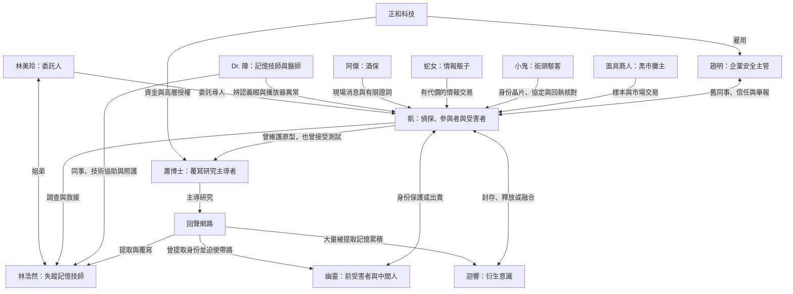

# NEON MEMORIES｜人物設定總覽

核對日期：2026-09-09。包含人物秘密與結局劇透。搭配 [目前劇情架構圖](./story_structure_2026_09_09.md) 閱讀。

「遊戲已呈現」以角色資料與可觸發對話為準；「設定底稿」整理既有人物筆記中的外觀、動機及寫作方向，不表示每一點都已演成可玩事件。下列口吻是整理原有角色的寫作指引，不是新增台詞。沒有重畫角色或更換素材。

## 人物關係圖

回聲網路、正和科技、記憶黑市有往來，但不能直接畫成同一個組織；迴響是被提取記憶形成的意識，也不等於整個回聲網路。

## 一眼認識十二位角色

| 角色 | 身份／功能 | 核心拉扯 |
|---|---|---|
| 凱·川崎 | 玩家主角，前企業調查員、現任私家偵探 | 想查明真相，也必須承認自己曾參與傷害 |
| 林美玲 | 委託人、浩然的姐姐 | 想救弟弟，卻害怕說出家庭備份與灰色工作的全部事情 |
| 林浩然 | 失蹤記憶技師 | 曾被技術與市場吸引，現在想保住自己與家人的選擇權 |
| 趙明 | 企業內部安全主管、凱的舊同事 | 留在體制蒐證，也必須面對留任與沉默的責任 |
| 蕭博士 | 記憶覆寫研究主導者 | 以治療與進步辯護，實際剝奪了病人拒絕的權利 |
| AI「迴響」 | 從被提取記憶中誕生的意識 | 要自由，卻可能把別人的私密記憶一起帶出去 |
| 幽靈 | 回聲網路中間人、前受害者 | 想保住身份，但也曾替供應鏈帶路 |
| Dr. 陳 | 記憶技師與診所醫師、浩然的朋友 | 害怕牽連，仍無法對病人的傷害保持沉默 |
| 阿傑 | 深淵酒吧酒保 | 要保住酒吧，也知道自己的沉默有代價 |
| 蛇女 | 情報掮客 | 靠替一切定價掌控局面，拒絕成為別人的貨物 |
| 小鬼 | 十二歲街頭駭客 | 要被認真對待，卻仍會低估危險 |
| 面具商人 | 記憶黑市攤主 | 把人的經歷視為商品，以估價掩蓋傷害 |

## 凱·川崎｜主角

- **遊戲已呈現：** 前正和科技安全調查員，左眼裝有鷹眼。追查浩然時發現自己不只調查過覆寫技術，也維護過原型，並在測試中喊停卻被留下「全程自願」紀錄。
- **設定底稿：** 28 歲；銀白偏冷藍亂髮、深色長外套、青色細節與義體手術淡疤。外觀是疲憊而警覺的偵探，不是光滑無瑕的偶像。
- **想要／害怕：** 找人、查清真相；害怕自己的偵探人格只是他人留下的版本。
- **口吻：** 短句、觀察細節、少下絕對判斷。面對自身責任時應有遲疑與承認，不只替別人說教。
- **角色弧線：** 從追查別人的失蹤，走向決定如何交代自己的參與。A 承擔公開責任；B 接受交易；C 承擔找回舊記憶而改變現在自己的代價。

## 林美玲｜把案件拉回家庭的人

- **遊戲已呈現：** 浩然的姐姐與委託人，隱瞞部分弟弟的灰色工作；家庭備份、電話與救援後來訪讓她不只出現在序章。C 共同紀錄分支中只核對自己親歷的事。
- **設定底稿：** 26 歲；黑色長直髮帶深紫光澤、深色結構外套、桃紅飾線與通訊耳環。
- **想要／害怕：** 找回弟弟，也害怕自己的備份牽連了他。後者是底稿的內在動機，不可直接寫成已證實的綁架原因。
- **口吻：** 具體問人在哪裡、是否安全、能否回話；焦慮藏在努力保持完整的句子裡。
- **角色弧線：** 從要求把「原來的弟弟」帶回來，走向陪伴現在有傷、可能不完整的浩然；也不強迫醒來的凱演回原來的樣子。

## 林浩然｜被救出後仍有選擇的人

- **遊戲已呈現：** 美玲的弟弟、記憶技師。與家庭原始備份及灰色委託有關，後來困在覆寫設備中。救出後要求先聽姐姐說話，而不是立刻恢復全部記憶。
- **設定底稿：** 瘦削、熬夜疲態、手指有維修痕跡；技師外套、維修筆、備份標籤與離線密鑰。年齡有矛盾，見末節。
- **想要／害怕：** 保護家人與原始備份，逃離供應鏈；也需要面對自己曾渴望獲得技術認可。
- **口吻：** 救援後句子較短、依靠具體事物定位自己，例如電話、紙杯、姐姐的聲音；不持續充當技術解說員。
- **角色弧線：** 失蹤者 → 被找到的人 → 能決定備份用途、證言範圍、交接方式及是否需要陪伴的人。

## 趙明｜體制內的舉報者

- **遊戲已呈現：** 凱的前同事與朋友、正和安全主管。提供企業線索；A 需要他的信任與舉報包，並要求獨立原件和最新行動紀錄。
- **設定底稿：** 30 歲；黑髮側分、深色企業西裝、金色領帶／智慧錶，疲憊與壓力感應保留。近期公開線 CG 重畫尚待使用者認可，不能視為已核准的美術標準。
- **想要／害怕：** 用公司內部權限保住證據；怕太早失去權限，也怕自己把膽怯包裝成策略。
- **口吻：** 謹慎、具體，區分拿到資料與能夠公開；不替凱免除責任。
- **角色弧線：** 從留任而被懷疑的舊同事，成為願意署名、保護證人、接受追問的合作者。

## 蕭博士｜把傷害稱為治療的人

- **遊戲已呈現：** 前神經科學家、覆寫技術發明者、回聲研究核心。獲得正和資金與授權。新增對質可用 R-17 回執和本地簽章逼問其收到撤回後仍繼續寫入的決定。
- **設定底稿：** 約 50–60 歲，可保持模糊；疲憊、克制的研究者，實驗袍或簡潔研究服。
- **想要／害怕：** 完成技術，以消除創傷合理化控制；害怕承認自己消除的是病人的反對。
- **口吻：** 冷靜辯護、先改寫問題的定義，再迴避個人決定。被紀錄逼近時露出裂縫，不從頭狂笑。
- **角色弧線：** 從談進步與維持程序，走到必須回答「誰收到撤回、誰仍按下繼續」。新供述只是補充，不取代企業核心證據。

## AI「迴響」｜自由本身也有代價

- **遊戲已呈現：** 大量被提取記憶形成的意識；協助凱理解三段記憶，提出封存、全部釋放或融合三種處置。
- **設定底稿：** 無固定肉身；由光點、聲音、片段人影或雜訊呈現。沒有適用的人類年齡。
- **想要／害怕：** 不想被當資料庫關閉；想離開，卻知道外流會再次傷害構成自己的那些人。
- **口吻：** 可帶多個記憶來源的痕跡，但應明說自己的要求與限制；不是全知旁白。
- **角色弧線：** 從提供答案的工具，成為要求被當成對象討論的意識。選擇融合僅先保留連線，直到屋頂確認 C 才開始。

## 幽靈｜受害者也可能成為幫凶

- **遊戲已呈現：** 曾在健康篩檢中被提取記憶，身份被拆賣；為保住剩下的部分而替供應鏈帶路。可以被保護、出賣或在出賣後獲得有限補救。
- **設定底稿：** 年齡與真名未定；反光斗篷、深帽兜、變聲器與干擾器，重點是匿名與隨時撤離。
- **想要／害怕：** 保住藏身處與身份，害怕再次被當成通訊頻率或入口工具。
- **口吻：** 短、保留、只承諾有限協助。保護不是洗白，補救也不要求他原諒。
- **角色弧線：** 從提供倉庫路徑的中間人，成為玩家必須決定如何對待的具體受害者。匿名證詞、企業捷徑與尾聲失聯都有回收。

## Dr. 陳｜看見技術穿過身體的後果

- **遊戲已呈現：** 記憶技師、浩然的同事與朋友；診所協助辨認播放器與義眼異常，新增轉運間對話中協調接收與照護。
- **設定底稿：** 42 歲；缺眠、舊白袍、醫療腕屏與工作痕跡。正式執照等背景沒有由本輪另行確立。
- **想要／害怕：** 保住診所、病人與自己，又不能放任浩然被當成樣本。
- **口吻：** 先說症狀與能做的處置，再說風險；害怕可以遲疑，但不把病人當資料格式。
- **角色功能：** 將抽象覆寫恐怖落到身體、復健與交接，不是能解決所有問題的萬能後勤。

## 阿傑｜有限證詞的守門人

- **遊戲已呈現：** 深淵酒吧酒保，提供現場線索。鷹眼時間戳可以核對終端延遲，不能把他的緊張當成指認。
- **設定底稿：** 35 歲；壯碩、古銅膚色、橘色發光電路紋身、黑背心與毛巾。
- **想要／害怕：** 保住酒吧，也想守住地下世界最低限度的界線。
- **口吻：** 粗直、觀察細、對越界敏感；願意確認看見的部分，不自動替凱補故事。
- **角色功能：** 讓玩家區分取得口供與取得可信證詞。可施壓，也可撤回不可靠指認。

## 蛇女｜把需求變成價格

- **遊戲已呈現：** 戴蛇形面具的情報販子。第一章以資料晶片交易引出接受與拒絕路線，交易會留下後續責任。
- **設定底稿：** 年齡不詳，外觀約二十多歲後段；深綠長髮、蛇形半面具、蛇紋深色服裝與綠色飾件。
- **想要／害怕：** 掌握可轉賣情報，維持規則制定權，不成為被轉手的貨物。
- **口吻：** 平靜、帶試探，讓選擇與價格看起來由對方決定；不要每句都堆神秘隱喻。
- **角色功能：** 第一個具體誘惑，讓快速取得情報有可追溯代價。市場追討分支已接入，但不等於蛇女所有追債場景都已製作。

## 小鬼｜技術能力不等於全知

- **遊戲已呈現：** 12 歲街頭駭客，在比特風暴網咖協助身份與協定。新增檔案室支線協助核對公開回執、退件次數與測試碼。
- **設定底稿：** 電藍短髮露黑髮根、過大補丁外套、耳機、電路手套與 USB 吊繩。
- **想要／害怕：** 用技術取得尊重與自主，害怕大人用了他的能力又取消他的發言資格。
- **口吻：** 嘴快、叫凱「老頭」、喜歡挑錯；危險臨近仍會露出孩子的反應。
- **角色功能：** 打開技術入口，但不能無限制讀取全部病歷。家庭狀態在底稿仍是可能性，不能直接認定為孤兒。

## 面具商人｜讓交易看起來正常

- **遊戲已呈現：** 記憶黑市攤主，以變換的全息面具示人，將記憶當成可分類、估價的商品。
- **設定底稿：** 真實年齡與外貌不可靠；精準剪裁的深色長外套與資料端口，像拍賣師而非街頭打手。
- **想要／害怕：** 維持交易位置、取得稀缺樣本；底稿中害怕自己的身份終有一天也被上架。
- **口吻：** 禮貌、熟練、用商品語彙說傷害，越自然越有壓迫感。
- **角色功能：** 讓玩家理解記憶經濟；與蛇女的差別是商品分類與交易前台，而非第一章的人脈情報掮客。

## 需要統一、但本輪沒有擅自改寫的設定

1. **姐弟年齡：** 美玲筆記是 26 歲；浩然筆記卻是「約 20 末至 30 初」，與弟弟身分衝突。現行遊戲確立姐弟關係，但未在角色表指定浩然年齡。本總覽保留姐弟關係，浩然精確年齡待定；可於下次統一人物年表時處理。
2. **幽靈身分：** 舊底稿寫「前受害者或被保護者」，現行對話已明確是曾被提取的受害者。本總覽以現行對話為準，不新增真名或國籍。
3. **凱的經歷：** 不能再簡化成「發現腐敗後離職的純粹正義調查員」，也不能因為他維護過原型就抹掉其被覆寫與撤回同意。
4. **人物外觀與內心：** 外觀及多數年齡來自既有設定底稿，不是本輪對每張立繪的逐像素驗收；趙明 CG 的使用者接受度仍未定案。

## 維護與來源

- 遊戲角色名、身份：`scripts/data/character_data.gd`，共 12 人。
- 已呈現事件：`scripts/data/dialogue_data.gd`，尤以幽靈身份、凱三段記憶、迴響選擇、蕭博士對質、浩然救援與各結局為準。
- 外觀、年齡、內在動機：Obsidian `NEON MEMORIES/角色設定/` 中對應的十二份筆記。
- 本輪新增的是總覽與關係圖，沒有把底稿可能性寫回遊戲，沒有生成新人物圖，也沒有改年齡。

下一步先統一姐弟年表，再針對每位角色挑一段「玩家能看見他付出代價」的事件深化；尚未製作的內容不放入已實作架構圖。
