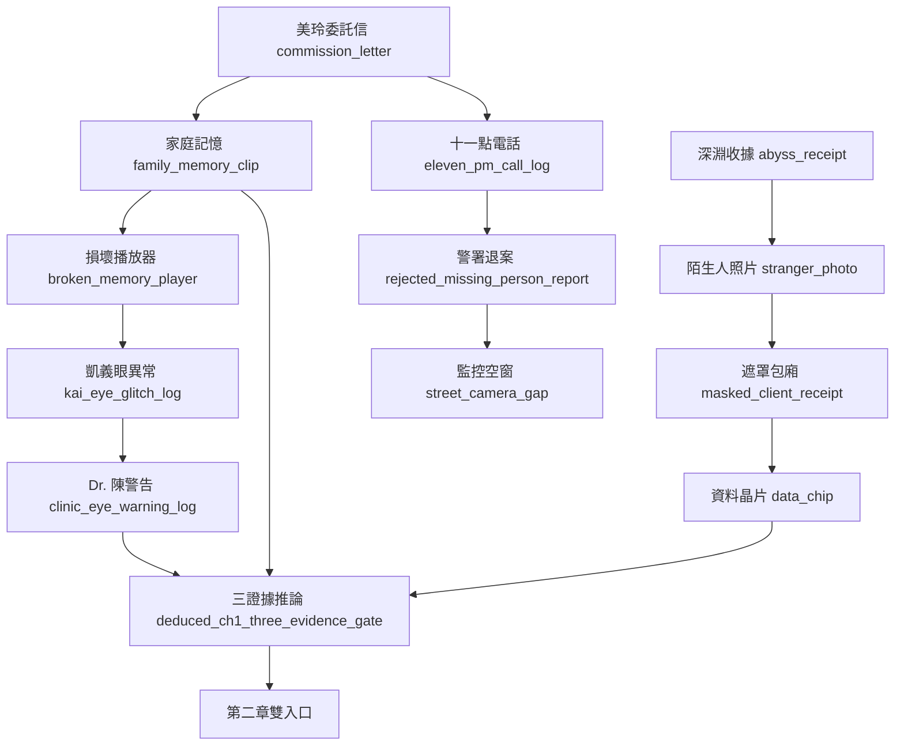
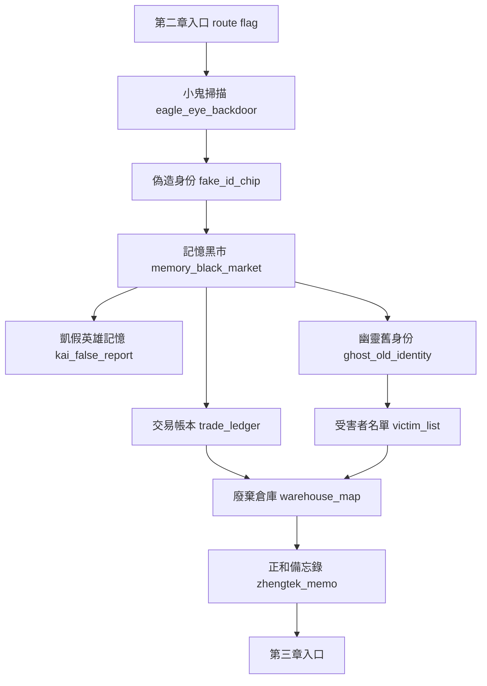
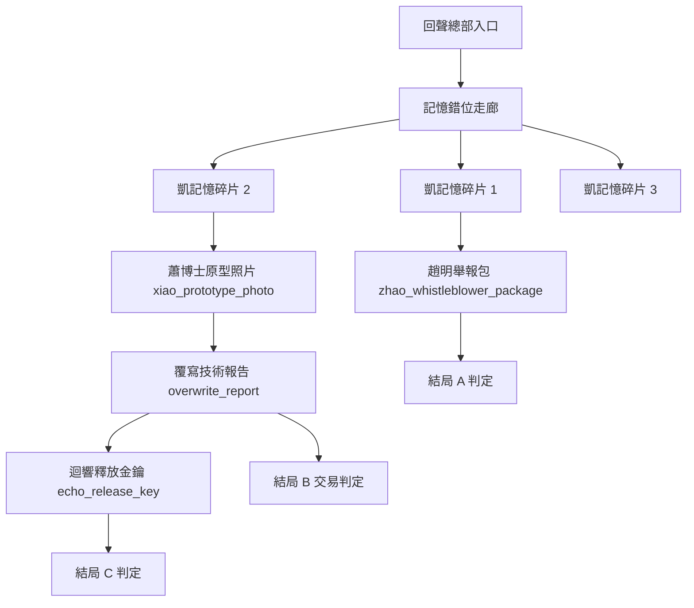

# NEON MEMORIES 劇情設計總檔

本檔是劇情修改與後續生成遊戲資料的工作藍圖。它整理「章節目的、地圖場景、證據鏈、分支旗標、可生成資料 ID、仍缺內容」，方便後續把劇情改稿轉成 `CaseData`、`DialogueData`、`EvidenceData`、場景、圖片與測試。

## 2026-09-09 跨章分流提案

[跨章分流製作規劃](./chapter_branch_plan_2026_09_09.md) 已整理第二章兩條調查線、第三章兩種局面、換路代價、四張素材預算與舊檔驗收。尚未實作，不取代下方現況架構。

## 2026-09-09 架構與人物索引

現行可玩內容見 [劇情架構圖](./story_structure_2026_09_09.md)；十二位角色及設定待統一事項見 [人物設定總覽](./character_profiles_2026_09_09.md)。本輪僅整理文件，未改遊戲。

## 2026-09-08 四色鷹眼、掃描地點與新地圖（最新）

- 能量條改成四個柔和色區，十格採 3／2／2／3 對稱分配，外框與格位不變。耗能掃描由 3 增至 10，十處均有開啟鷹眼後可點選的場景標記，也保留調查清單入口。
- 新增第二章「市政離線檔案室」（連接網咖／正和外圍）、第三章「復健轉運間」（救援後連接實驗室／屋頂），目前共 20 個地點。兩張背景已正式生成，raw／source／runtime／提示詞／manifest 皆落地。
- 新增 12 段對話：七處掃描、兩段進場、蕭博士紀錄對質、退件索引核對與浩然的安靜片刻。R-17 為匿名案例代碼，不直接等同浩然；用紙本回執、接收與本地簽章追問撤回後仍寫入的責任。算錯退件人數或拿錯證據可重試。
- 倉庫調查重點影響轉運間及尾聲；出貨紀錄影響趙明核驗說明。C 新增共同生活紀錄／密封私信兩種甦醒回應，原有略過支線的 C 仍保留；恢復記憶的代價沒有被取消。浩然可以要求安靜陪伴或自己嘗試拿水，回收到尾聲。
- 第二、三章補 14 項證據讀取，合計 29 項；正式證據仍為 39。調查清單可開啟已保存的鷹眼紀錄，跨章保留、閱讀不耗能。手機提示已接上新標記，修正小畫面標記碰到能量條、濾鏡壓暗標記與重複調查彈窗。
- 驗證：完整 933 通過、0 失敗、0 警告；七條真實新遊戲路線涵蓋 A1／A2、B 兩種照護、C 共同紀錄／私信／略過。GPU 版面 924 項、能量條 360 項、掃描／分支 75 項、配樂 23 項通過；GPU A2 通關 208 個操作、60 張畫面，走過 20 個地點。這是加速操作，不代表真人遊玩時長。
- 素材現在為 140 張 PNG＋3 首配樂；新背景使用工具原生 1672×941 不透明 RGB，沒有假稱為提示詞要求的 1920×1080。四段短音效與 32 張既有原圖追溯缺口未變。沒有提交／推送。
- 下一步：先實玩新地點停留與對話節奏，再深化蕭博士多輪對質、三段記憶交叉核對；證據板字級、小橫向完整 CG 查看、B／C 新 CG、P2 四張道具與實體手機驗收仍待完成。生物指標審訊仍未接成玩法。
- 完整紀錄：[[2026-09-08 四色鷹眼與地圖劇情擴充]]；專案報告 C:/Projects/cyberpunk-gaming/docs/scan_maps_expansion_2026_09_08.md。下方舊段落的「未實作」與素材數量保留歷史，以本節狀態為準。

## 2026-09-08 P1 劇情延伸已接入（歷史更新）

- 已製作幽靈身份核對與回訪／補救、三種總部入口，以及公開結局的獨立原件核驗與最新行動紀錄確認。跳過支線仍能自行進入總部；補救不抹除身份外流，會失去企業捷徑。
- A 保留正義之光主方向，新增「共同作證／帶罪揭露」。不再以黑市妥協次數硬鎖，改為核驗與如實交代；釋放私人記憶後需更新聲明。B／C 主結局本輪未擴分支。
- 新增 2 項證據（正式共 39 項）、2 張 512×512 去背物品圖與 1 張 1920×1080 結局 CG，原圖／修正版／處理後來源／runtime／提示詞皆落地。現行 138 張圖片＋3 首配樂；4 段短音效仍缺。
- 修正高解析 CG 撐大畫面導致裁切；已作 GPU 桌面與手機模擬顯示檢查。舊檔已結案結果保留；未完成的舊公開選擇會重新開放，允許回頭補做核驗。
- 完整檢查 923 通過、0 失敗、0 警告；四條真實新遊戲通關涵蓋 A1／A2 與三種入口，舊檔與行動紀錄回歸通過；GPU 對話／CG 顯示 147 項通過。
- 完整紀錄：[P1 完成內容與遊玩方式](C:/Projects/cyberpunk-gaming/docs/story_p1_completed_2026_09_08.md)。Obsidian 同步檔：2026-09-08 P1 劇情延伸完成紀錄.md。
- 下一步：實玩第一批節奏，再做 P2 蛇女追債與浩然備份；P2／P3 與剩餘素材仍屬提案。下方早期結局條件與素材數量保留歷史，此段優先。

## 2026-09-08 劇情延伸與素材規劃（提案，未實作）

- 已整理幽靈／蛇女／浩然支線、第三章入口差異、證據對質與記憶核對；建議先完成幽靈到 A 結局的完整體驗。
- 結局提案維持 A／B／C 三方向，各兩種主要結果；公開線擬由具體補證與承認責任取代黑市次數硬鎖，記憶線需另外交代案件證據處置。所有新規則仍待逐場設計，現行結局條件未改。
- 素材預算：基礎 9 張（6 物品、3 CG），可選 5 張（3 表情、2 場景／疊圖）；首批 2 物品＋1 CG。沿用現有角色、地圖、UI 及三首配樂。
- 音訊另列 4 段既有缺口與 2 段延伸需求，未生成／選定；被否決的舊試聽不採用。規劃項目尚未加入 runtime 或素材 manifest。
- 完整提案：[劇情延伸與素材規劃](C:/Projects/cyberpunk-gaming/docs/story_expansion_plan_2026_09_08.md)。Obsidian 同步檔：2026-09-08 劇情延伸與素材規劃.md。
- 本輪僅整理文件，已核對 UTF-8 與同步內容；沒有修改遊戲或重跑遊戲測試。下一步為 P1 逐場腳本與分支規則，尚未進入製作。

## 2026-09-08 舊檔與原型清理完成（歷史更新）

- 426 個舊檔已從專案移至 Windows 資源回收筒，約 305.9 MiB，可還原。包含舊能量圖、失敗／重複角色圖、被否決的音效試聽、假 OGG、舊產圖工具及未接入原型；相關引用、清單與測試已同步整理。
- 現行素材為 135 張圖片與 3 首配樂，來源與 runtime 指紋相同。103 張圖片有獨立原圖紀錄，32 張的追溯缺口維持前輪揭露；四個正式短音效現在均標為尚未交付，安全略過缺檔。
- 原圖／提示詞仍存於 assets/generated/，runtime 仍在 assets/sprites/；角色 50 表情、37 證據、18 地點與三結局流程保留。
- 完整資料與 Godot 整合檢查：921 通過、0 失敗、0 警告；三條實際通關與 27 種尾聲組合、PCK 24 項、BGM 21 項、能量 141 項及對話版面檢查通過；Godot 編輯器匯入、素材核對與 git diff --check 通過。
- 詳細完成紀錄：C:/Projects/cyberpunk-gaming/docs/cleanup_completed_2026_09_08.md；逐檔清單：docs/verification/cleanup_2026_09_08.json。
- 先前永久刪除遭拒的限制已以可還原的資源回收筒操作解決，沒有更改權限或規則。下一步：正式短音效、原圖追溯、實機／匯出驗證。

## 2026-09-08 素材保存與載入重構（清理前紀錄）

- 149 張圖片與 3 首配樂的來源／runtime 路徑和指紋一致，固定引用沒有非預期缺檔。總清單 assets/asset_manifest.json，檢查器 tools/audit_assets.py。
- 保存 81 份早期原圖到專案 raw/ 目錄；117 張圖片具備獨立原圖追溯，32 張只有處理後來源，仍缺獨立原圖紀錄。三個短音效未存在、家庭記憶短音效仍為佔位檔。
- 七份圖片載入器收斂為 runtime_assets.gd，能量框亦共用；修正沒有原始 PNG／OGG 的 PCK 資源被誤判不存在。generated 與 docs 加入 .gdignore，Git 仍保留來源。
- 驗證：完整 961 通過／0 失敗／0 警告；PCK 22 項、GPU 對話 36 項、GPU 能量 357 項通過，編輯器匯入通過。正式匯出包與實體手機仍待驗收。
- 使用者要求清理不用檔案；已列 421 個候選檔，約 305.9 MiB。**工具自動審核兩次拒絕刪除，實際刪除 0 個，所有候選檔仍在。** 未接入原型尚未刪除，不能把它們當現行遊戲功能。
- 詳細核對：C:/Projects/cyberpunk-gaming/docs/asset_storage_refactor_2026_09_08.md。待清理清單：docs/verification/cleanup_2026_09_08.json。
- 下一步：工具允許刪除後同步清理檔案、引用及舊測試，重跑通關；補獨立原圖紀錄與正式短音效。

## 2026-09-08 把人帶回家與操作修正（前輪紀錄）

- 已新增並接入四段劇情：第二章網咖回撥美玲、第三章屋頂探視浩然、三結局後的辦公室家人來訪、尾聲未讀訊息。家人尾聲補足原本「救出後缺少照護與相處」的缺口；未讀訊息回收幽靈、黑市與 ECHO 的選擇。
- 新增 family_update_choice／hao_ran_aftercare，分別決定坦白風險與照護／有限證言；舊存檔補 none，支線可跳過，不新增結局門檻或正式證據。錄音須先取得浩然意願並再確認，家人離線保管，不自動公開或隨交易交出。
- 修正對話中證據板繞過存檔保護、桌面／手機選項截斷；三項完整可見、更多使用原生捲動並跟隨鍵盤焦點。短小假 OGG 在解碼前略過，家庭短音效本身仍未補齊。
- 驗證：完整 959 通過／0 失敗／0 警告（含新增核心旗標回歸）；三條實際通關、27 種尾聲組合、GPU 對話框 36 項、BGM 21 項及能量 141 項通過。手機目前為桌機模擬尺寸，仍需實機驗收。
- 本輪沿用既有角色與 UI 圖，沒有新增美術或採用被否決的四段合成音效。下一步：實玩新劇情節奏、選家庭記憶與環境短音效、實機觸控驗證。
- 詳細紀錄：C:/Projects/cyberpunk-gaming/docs/homecoming_update_2026_09_08.md；畫面：docs/verification/homecoming_2026_09_08/。

## 2026-09-08 實作基準：三章流程與三結局

本節是目前可執行的規則；下方保留的 2026-04-29 幕次、素材與 ID 提案屬設計歷史，不能直接視為尚待實作的清單。完整整合紀錄見 [本輪完成紀錄](C:/Projects/cyberpunk-gaming/docs/story_completion_2026_09_08.md)。

### 行動力與章節

- 移動消耗 1 AP；AP 不足會阻止移動，不會自動跳章。地圖提供「休整」恢復行動力，玩家可以回查線索。
- 第一章完成三證據推理及蛇女路線收束後設定 `chapter_1_complete`；第二章完成倉庫調查、備忘錄核對與章末確認後設定 `chapter_2_complete`。
- 完成旗標只解鎖地圖的「前往下一章」。玩家明確按下後才播放章節標題並進入下一章起始地點；旗標、AP 歸零或普通地圖移動都不直接改章。

### 本輪已接入的選擇與後果

| 節點 | 實作 ID / 狀態 | 玩家選擇與後果 |
|---|---|---|
| 第二章雙入口 | `ch2_opening` 條件 entry | 接受蛇女交易取得拍賣身份；拒絕則收到 Dr. 陳的離線掃描建議，仍可經下水道調查倉庫。沒有新增兩個獨立 opening ID |
| 記憶交易 | `ch2_memory_trade_choice`、`market_trade_resolved` | 買線索取得樣本/地圖並增加一次妥協；侵入取得樣本/帳本、暴露身份並增加義眼使用負擔；拒絕仍可查倉庫。不能反覆改選或刷收益 |
| 幽靈身份 | `ch2_ghost_identity_reveal`、`ghost_identity_resolved` | 保護採樣身份可取得匿名合作；出賣給黑市額外取得帳本，但增加妥協、降低信任並失去證人回應。沒有把出賣當成經同意的公開證據 |
| 第二章收束 | `ch2_warehouse_explore` → `ch2_verify_zhengtek_memo` → `ch2_conclude_investigation` | 日記、受害者名單及企業備忘錄互證；選署名合作或自行保管，最後確認總部路線 |
| 第三章核心證據 | `ch3_memory_corridor`、`ch3_secure_core_evidence`、`ch3_dr_xiao_confrontation` | 分別取得既有授權令、資金流向與覆寫報告；實作為對話/調查節點，未新增走廊視覺特效 |
| 三段記憶 | `ch3_kai_fragment_1/2/3` | 依序核對調查、原型維護、測試與撤回同意；用 `kai_memory_1_seen` 至 `kai_memory_3_seen` 記錄，最後設定 `kai_memory_truth_reviewed` |
| 浩然救援 | `ch3_hao_ran_found` → `ch3_rescue_hao_ran` | 找到只設定 `hao_ran_located`；取得報告、隔離寫入、解除固定並確認安全撤離後，才設定 `hao_ran_rescued` |
| 迴響要求 | `ch3_echo_release_choice`、`echo_choice_resolved` | 封存、釋放或同意融合。釋放會外流受害者隱私；同意融合先保留連線，屋頂再確認才真正恢復 |
| 舉報與終局 | `ch3_zhao_whistleblower`、`ch3_rooftop_choice` | 趙明署名、公開副本保護受害者身份；屋頂顯示未滿足條件，可返回調查，最後明確選公開/交易/記憶恢復 |

### 三結局的現行門檻

三條路共通要求：已進第三章、`hao_ran_rescued`、`xiao_confronted`、`core_evidence_secured`，並持有 `overwrite_report`、`zhengtek_funding`、`authorization_order`。

| 結局 | 額外條件 | 最後決定 |
|---|---|---|
| A 正義之光 | `trusted_zhao_ming`、`public_truth_ready`、`zhao_whistleblower_package`；`black_market_compromise_count <= 1` | `final_resolution = public` |
| B 灰色交易 | 共通要求全部成立 | `final_resolution = deal`；證據不足不會自動落入 B |
| C 記憶重生 | `kai_memory_truth_reviewed`、`echo_choice_resolved`、`memory_restoration_consented`；`memory_attitude = accept` 且 `echo_fate = merge` | `final_resolution = memory`，再次確認自我代價 |

屋頂選擇設置 `final_choice_resolved`，再執行最後決定完成結局；結案後用 `case_resolved` / `resolved_ending` 保留結果。證據收集比率、推理總數或鷹眼使用次數都不再自動指定結局；過度使用警告與污染敘事不等於同意恢復，單獨釋放迴響也不滿足 C。

### 證據與素材範圍

正式證據仍為 **37 項**。三段記憶共用既有 `kai_memory_fragment` 與完成旗標；舉報包由三份核心證據加 `zhao_whistleblower_package` 旗標組成，這個名稱不是新增 evidence ID。幽靈與義眼後門也以現有證據、對話與旗標實作。本輪沒有建立提案中的 8 個新證據或其素材，也未新增記憶片段、金鑰、舉報包等獨立 icon/CG。

### 驗證與下一步

- Godot 完整通關：A 路線從新遊戲到尾聲，34 項證據 / 18 個推理 / 121 steps；B 為 35 / 19 / 114；C 為 36 / 20 / 121。這是三條實際測試路線的結果，不表示已枚舉所有選擇組合。
- 已確認 `PROGRESS_SCORE=802`、鷹眼檢查分數 `273`。它們是靜態檢查分數，不是完成百分比，也不替代實際通關。
- 最終資料完整性：**950 passed、0 failed、1 warning**；唯一已知警告是家庭記憶音效 placeholder。
- 39 項負例通過，包含舊存檔缺少新 decisions 或 arrays、Continue 回到 PLAYING，以及對話/轉場期間拒絕寫入並保留原存檔 bytes。三條通關 trace 與負例記錄保存於 [驗證紀錄](C:/Projects/cyberpunk-gaming/docs/verification/story_playthrough_2026_09_08.json)。
- `family_memory_fragment.ogg` 仍為 placeholder；真實音效替換、人工桌面畫面檢查與手機畫面/操作測試尚未完成。
- 下一步替換家庭記憶真實音效並進行人工桌面/手機體驗驗收；不重複新增本輪已落地的二三章分支。

## 使用方式

- 修改劇情時，先改本檔，再決定是否同步改 Godot data。
- 每個新劇情節點都要有明確用途：推進地點、取得證據、改變旗標、改變角色信任、或服務結局條件。
- 不要只新增收藏品或單純氣氛文本；若一段內容不影響玩家判斷或推理，它應該留在演出層，不進核心證據鏈。
- 三章主線與二三章選擇已接通；目前實作以本檔「2026-09-08 實作基準」為準，後續優先完成驗證與演出素材。
- 角色深層設定以 Obsidian `角色設定/` 為準；組織與場所深層設定以 Obsidian `組織設定/` 為準。

## 全局劇情核心

### 主題

記憶是最昂貴的貨幣，而真相永遠需要代價。玩家不是單純找人，而是在追查一個城市如何把人的痛苦、身份與證詞加工成商品。

### 主線問題

1. 林浩然為何失蹤？
2. 浩然為何選擇凱？
3. 凱的義眼為何能讀到回聲網路深層訊號？
4. 回聲網路究竟是在販賣記憶，還是在培養某種由記憶堆積出的意識？
5. 玩家最後要公開真相、交易真相，還是用自己的記憶換回真相？

### 三條分歧軸

| 軸線 | 代表問題 | 主要影響 |
|---|---|---|
| 公開真相 | 玩家是否累積足夠公開證據並取得趙明信任？ | 結局 A：正義之光 |
| 黑市妥協 | 玩家是否用交易、偷看、出賣資料快速推進？ | 結局 B：灰色交易 |
| 記憶融合 | 玩家是否核對三段記憶、理解自我代價，並在屋頂確認與迴響融合？ | 結局 C：記憶重生；不由鷹眼次數自動觸發 |

## 主要角色功能表

| 角色 | 劇情功能 | 不能偏移的核心 |
|---|---|---|
| 凱·川崎 | 玩家視角、記憶不可靠者、義眼後門承載者 | 不是超級英雄；他的工具本身就是案件的一部分 |
| 林美玲 | 第一章委託人、家庭情感錨點、隱瞞者 | 她知道浩然碰危險案子，但低估牽涉範圍 |
| 林浩然 | 失蹤案中心、技術越界者、主動留下線索者 | 不是單純受害者；他半主動布局讓凱進場 |
| 阿傑 | 第一章街頭情報與酒吧入口 | 小人物情報源，不應掌握核心真相 |
| 蛇女 | 第一章交易分歧、第二章黑市入口 | 她賣入口與籌碼，不替玩家做道德判斷 |
| Dr. 陳 | 義眼醫療解釋、灰色診所入口 | 他提供專業警告，但不主導陰謀 |
| 小鬼 | 第二章技術入口、鷹眼後門揭露 | 街頭駭客，不是全能駭客 |
| 面具商人 | 黑市商品化誘惑 | 把記憶定價，但不是回聲網路核心 |
| 幽靈 | 黑市中間人、前受害者支線 | 他被網路保護也被困住 |
| 趙明 | 正和科技內部舉報通道 | 制度內改革者，不提前揭露凱完整過去 |
| 蕭博士 | 覆寫技術發明者、倫理崩壞核心 | 不是瘋子，而是慈悲滑向控制 |
| AI「迴響」 | 被剪掉記憶形成的意識、第三章信任軸 | 第一章只出現痕跡；第三章才正面對話 |

## 第一章：失蹤的記憶

### 章節定位

第一章是接案、家庭情感、義眼異常與黑市入口章。核心問題是「浩然為何選凱」。玩家要從美玲的隱瞞、浩然留下的家庭備份、凱的義眼握手異常、蛇女的交易中，組出通往第二章的路。

### 章節情感

美玲想救弟弟，但害怕說出浩然替非法客戶處理記憶會讓凱拒絕接案。浩然想保護美玲的原始記憶備份，也知道只有凱的舊正和義眼能讀到他留下的深層線索。凱表面冷硬，實際上被家庭記憶中的缺口刺中自己的失去。

### 已接入地圖

| 地點 ID | 顯示名稱 | 劇情用途 | 狀態 |
|---|---|---|---|
| `detective_office` | 偵探辦公室 | 開場接案、建立凱與義眼舊傷 | 已接入 |
| `mei_ling_apartment` | 林美玲的公寓 | 家庭記憶、播放器、十一點電話、原始備份 | 已接入 |
| `east_district_street` | 東區街道 | 警署前哨、監控空窗、城市壓迫 | 已接入 |
| `abyss_bar` | 深淵酒吧 | 蛇女、資料晶片交易、黑市入口 | 已接入 |
| `hao_ran_workshop` | 浩然的工作室 | 終局推理、浩然動機、黑市入口提示 | 已接入 |

### 第一章幕次

#### 第 0 幕：偵探事務所

- 場景目的：建立凱的職業狀態、舊正和義眼、美玲委託。
- 玩家任務：接案並取得 `commission_letter`。
- 伏筆：義眼對「浩然」名字出現低階雜訊。
- 可用資料：
  - dialogue: `ch1_mei_ling_intro`
  - evidence: `commission_letter`
  - flag: `kai_checked_office_with_eagle_eye` / `kai_suppressed_eye_warning`

#### 第 1 幕：林美玲公寓

- 場景目的：補家庭生活細節與美玲隱瞞。
- 玩家任務：調查浩然房間、家庭相簿、記憶播放器、十一點電話。
- 證據鏈：
  - `family_memory_clip`
  - `broken_memory_player`
  - `kai_eye_glitch_log`
  - `eleven_pm_call_log`
  - `original_backup_hint`
- 已接入 story action：
  - `inspect_hao_ran_drawer`
  - `inspect_original_backup_album`
  - `review_family_memory_clip`
  - `scan_broken_memory_player`
  - `inspect_eleven_pm_call_log`
- 修改重點：
  - 美玲不能全知。她隱約知道浩然碰了非法工作，但不知道鄭泰義眼、回聲網路或迴響 AI。
  - 家庭記憶要溫暖但不煽情，重點是讓玩家理解浩然的保護動機。

#### 第 2 幕：東區街道與舊城警署前哨

- 場景目的：展示制度壓迫與警方拒絕立案。
- 玩家任務：取得退案紀錄、比對監控空窗。
- 證據鏈：
  - `rejected_missing_person_report`
  - `street_camera_gap`
- 已接入 story action：
  - `visit_old_city_police_outpost`
  - `review_east_district_camera_gap`
- 修改重點：
  - 警方不是全員邪惡，而是被企業鑑定、案件量與政治風險壓到麻木。
  - 監控空窗要指向「有人能改城市資料」，不是單純攝影機壞掉。

#### 第 3 幕：深淵酒吧

- 場景目的：把調查轉成交易壓力。
- 玩家任務：追查包廂紀錄，與蛇女談 `data_chip`。
- 證據鏈：
  - `abyss_receipt`
  - `stranger_photo`
  - `masked_client_receipt`
  - `data_chip`
- 已接入 story action：
  - `investigate_abyss_backroom`
  - `negotiate_snake_data_chip`
- 分支：
  - 接受蛇女交易：設定 `accepted_snake_deal`、`black_market_route_opened`、`black_market_compromise_count += 1`
  - 拒絕蛇女交易：設定 `rejected_snake_deal`、`clinic_route_opened`
- 修改重點：
  - 蛇女給的是入口與代價，不是答案。
  - 接受交易不應立刻壞結局，只是讓第二章從黑市拍賣線開始。

#### 第 4 幕：Dr. 陳診所

- 場景目的：解釋義眼維修握手協定與潛在後門。
- 玩家任務：確認播放器與凱義眼同源，取得專業警告。
- 證據鏈：
  - `dr_chen_schedule`
  - `clinic_eye_warning_log`
- 已接入 story action：
  - `consult_dr_chen_eye_warning`
  - `visit_dr_chen_clinic`
- 修改重點：
  - Dr. 陳只說技術風險，不揭露完整陰謀。
  - 義眼規則：核心資訊可信，但畫面可能被凱的記憶缺口污染。

#### 第 5 幕：浩然工作室終局推理

- 場景目的：整理家庭備份、義眼握手、黑市入口三條證據。
- 玩家任務：用證據板完成三證據推論，打開第二章路線。
- 必要推論：
  - 家庭備份：`family_memory_clip` / `original_backup_hint`
  - 義眼握手：`kai_eye_glitch_log` / `clinic_eye_warning_log`
  - 黑市入口：`data_chip` / `masked_client_receipt` / `black_market_entry_hint`
- 已接入 story action：
  - `decode_eye_signature`
  - `reconstruct_hao_ran_motive`
  - `decode_hao_ran_last_message`
  - `compile_ch1_three_evidence_inference`
- 完成條件：
  - 取得必要證據不等於完成。
  - 必須透過證據板形成推論，尤其是 `deduced_ch1_three_evidence_gate`。

### 第一章可修改缺口

| 缺口 | 建議處理 |
|---|---|
| 警署前哨、Dr. 陳診所、深淵酒吧後室仍可升級為獨立地點 | 若要強化探索節奏，新增 location scene 與地圖連線 |
| 第一章路線與第二章條件開場已接入 | `ch2_opening` 讀取 `accepted_snake_deal` / `rejected_snake_deal`；不新增獨立開場 ID |
| 鷹眼過度使用目前只是警告 | 第二章/第三章要把 `eagle_eye_overuse_count` 轉成記憶污染風險 |

## 第二章：記憶黑市

### 章節定位

第二章是誘惑與代價章。玩家不只是追查回聲網路，而是第一次看見記憶如何被分類、估價、轉運與消費。第一章蛇女選擇決定第二章入口：接受交易走黑市拍賣，拒絕交易走 Dr. 陳診所與義眼追查。

### 章節情感

真相變得更容易取得，也更骯髒。玩家可以花代價買到答案，也可以拒絕交易、承擔更高調查成本。這章要讓玩家開始理解：在這座城市裡，記憶不是人的一部分，而是可抵押、可清洗、可轉售的資產。

### 已接入地圖

| 地點 ID | 顯示名稱 | 劇情用途 | 狀態 |
|---|---|---|---|
| `bitstorm_cafe` | 比特風暴網咖 | 條件開場、小鬼離線掃描、章末確認 | 已接入 |
| `memory_black_market` | 記憶黑市 | 面具商人、一次性買/侵入/拒絕選擇 | 已接入 |
| `abandoned_warehouse` | 廢棄倉庫 | 浩然日記、受害者名單與轉運調查 | 主線已接入；樣本處置三選仍為提案 |
| `zhengtek_exterior` | 正和科技大樓外圍 | 核對倉庫紀錄與企業備忘錄、選證據通道 | 已接入 |
| `sewer_passage` | 下水道通道 | 替代調查路徑、幽靈身份選擇 | 已接入 |

### 第二章建議幕次（2026-04-29 歷史提案）

以下保留原設計方向；目前已接入的對話與選擇以頁首 2026-09-08 表格為準。獨立雙開場 ID、另建後門證據及倉庫樣本三選並未照此清單全部建立。

#### 第 0 幕：雙入口開場

- 若 `accepted_snake_deal`：從黑市拍賣前置開始，蛇女引介，較快接觸面具商人。
- 若 `rejected_snake_deal`：從 Dr. 陳診所與小鬼追查義眼協定開始，較晚進黑市，但道德位置較穩。
- 必須保證兩條路都能進第二章核心，不造成死路。

#### 第 1 幕：比特風暴網咖

- 場景目的：取得黑市技術入口與偽造身份。
- 核心人物：小鬼。
- 建議新增 story action：
  - `scan_kai_eye_backdoor`
  - `forge_market_identity_chip`
  - `trace_echo_signature_route`
- 建議新增證據：
  - `fake_id_chip`
  - `eagle_eye_backdoor`
  - `echo_signature_route`
- 旗標：
  - `kid_scanned_eagle_eye`
  - `found_eagle_eye_backdoor`
  - `identity_exposed_market` 可在失敗或高風險選項中設定

#### 第 2 幕：記憶黑市

- 場景目的：讓玩家看見記憶商品化規則。
- 核心人物：面具商人、蛇女、幽靈。
- 黑市商品分級：
  - 娛樂記憶：低風險、低價、容易污染感官。
  - 創傷轉移記憶：能讓買家短暫理解他人痛苦，也可能造成心理傷害。
  - 身份記憶：高價非法貨，能偽裝履歷、證詞或人格。
  - 企業訂製人格樣本：正和科技與回聲網路真正的利益來源。
- 建議新增 story action：
  - `inspect_memory_trade_table`
  - `bargain_with_masked_merchant`
  - `choose_memory_trade_method`
- 建議新增證據：
  - `kai_false_report`
  - `memory_sample`
  - `trade_ledger`
- 分支：
  - 買線索：快速取得 `warehouse_map`，但 `black_market_compromise_count += 1`
  - 偷看受害者記憶：取得更強證據，但增加 `eagle_eye_overuse_count`
  - 拒絕交易：需要從幽靈或倉庫另找線索

#### 第 3 幕：幽靈支線與下水道通道

- 場景目的：讓幽靈不只是情報 NPC，而是前受害者。
- 建議新增 story action：
  - `uncover_ghost_old_identity`
  - `decide_ghost_protection_or_exposure`
  - `follow_ghost_sewer_route`
- 建議新增證據：
  - `ghost_old_identity`
  - `victim_list`
  - `comm_frequency`
- 分支：
  - 幫幽靈恢復身份：設定 `helped_ghost`
  - 利用幽靈換情報：增加黑市妥協
  - 把幽靈交給趙明：增加公開真相分，但幽靈信任降低

#### 第 4 幕：廢棄倉庫

- 場景目的：揭露記憶樣本物流、清洗、標記與轉運。
- 建議新增 story action：
  - `inspect_memory_sample_crates`
  - `decode_warehouse_transfer_log`
  - `rescue_or_copy_victim_sample`
- 建議新增證據：
  - `warehouse_map`
  - `victim_list`
  - `zhengtek_memo`
- 分支：
  - 複製樣本交給黑市：快速取得企業入口，但提高妥協
  - 保護樣本交給趙明：補強結局 A
  - 銷毀樣本：降低受害者風險，但失去部分證據

#### 第 5 幕：正和科技外圍

- 場景目的：把黑市證據連到正和科技。
- 核心人物：趙明初次或正式接觸。
- 建議新增 story action：
  - `meet_zhao_ming_exterior`
  - `verify_zhengtek_memo`
  - `choose_public_or_private_channel`
- 建議新增證據：
  - `zhengtek_memo`
  - `corporate_access_pattern`
  - `zhao_contact_token`
- 完成條件：
  - 玩家必須取得進入第三章的回聲總部路徑：技術路徑、黑市路徑或趙明內部路徑至少一條成立。

### 第二章可生成資料清單（歷史提案，非待辦清單）

| 類型 | ID | 說明 |
|---|---|---|
| dialogue | `ch2_dual_route_opening_market` | 接受蛇女交易後的黑市入口開場 |
| dialogue | `ch2_dual_route_opening_clinic` | 拒絕蛇女交易後的診所/義眼追查開場 |
| dialogue | `ch2_eagle_eye_backdoor` | 小鬼掃描義眼後門 |
| dialogue | `ch2_memory_trade_choice` | 面具商人交易選擇 |
| dialogue | `ch2_ghost_identity_reveal` | 幽靈舊身份揭露 |
| dialogue | `ch2_warehouse_memory_cleaning` | 倉庫清洗流程調查 |
| evidence | `eagle_eye_backdoor` | 義眼後門證據 |
| evidence | `kai_false_report` | 黑市販售的凱假英雄記憶 |
| evidence | `ghost_old_identity` | 幽靈前身份 |
| decision | `helped_ghost` | 幽靈支線善後 |
| decision | `public_truth_ready` | 公開真相線累積條件 |

## 第三章：回聲深處

### 章節定位

第三章是真相崩解與結局選擇章。玩家進入回聲網路總部、正和科技秘密實驗室與凱的記憶空間，逐步發現回聲網路不只是犯罪網絡，也是被提取、剪掉與壓縮的記憶堆積出的意識溫床。

### 章節情感

凱不能再只把案件當成別人的失蹤案。浩然的失蹤、蕭博士的技術、趙明的舉報、AI「迴響」的要求，都指向凱自己被剪掉的過去。第三章要讓玩家質疑：恢復記憶是否等於恢復自己。

### 已接入地圖

| 地點 ID | 顯示名稱 | 劇情用途 | 狀態 |
|---|---|---|---|
| `echo_network_hq` | 回聲網路總部 | 走廊比對、核心證據封存、趙明舉報包 | 已接入對話/調查；新走廊特效未製作 |
| `secret_lab` | 正和科技秘密實驗室 | 蕭博士對質、覆寫報告、浩然實際救援 | 已接入 |
| `memory_space` | 凱的記憶空間 | 三段順序記憶、迴響封存/釋放/融合選擇 | 已接入 |
| `rooftop` | 屋頂 | 缺少條件提示、明確最後選擇、執行結局 | 已接入 |
| `office_epilogue` | 偵探辦公室尾聲 | 結局回收 | 已接入 |

### 第三章建議幕次（2026-04-29 歷史提案）

目前已實作對話/調查形式的走廊比對、順序記憶、救援及迴響選擇。以下保留的視覺層切換、獨立照片/金鑰/三個片段證據與依樣本決定浩然復原程度，未宣稱完成。

#### 第 0 幕：進入回聲總部

- 入口依第二章結果變化：
  - 黑市入口：帶有身份暴露或交易債。
  - 趙明入口：更接近公開證據線。
  - 技術入口：依賴鷹眼後門，增加記憶污染風險。
- 建議新增 story action：
  - `enter_echo_hq_via_market`
  - `enter_echo_hq_via_zhao`
  - `enter_echo_hq_via_eye_backdoor`

#### 第 1 幕：記憶錯位走廊

- 場景目的：讓玩家用可玩方式體驗記憶不可靠。
- 規則：
  - 普通視野：公司走廊。
  - 鷹眼視野：診療室、雨夜街道、凱辦公室殘影疊在一起。
  - 證據視野：只有核心物件位置可信。
- 建議新增 story action：
  - `ch3_memory_corridor`
  - `align_memory_corridor_layers`
- 建議新增證據：
  - `kai_memory_fragment_1`
  - `xiao_prototype_photo`

#### 第 2 幕：秘密實驗室與蕭博士

- 場景目的：揭露記憶覆寫計畫的倫理崩壞。
- 核心人物：蕭博士、浩然。
- 建議新增 story action：
  - `confront_dr_xiao_prototype`
  - `inspect_overwrite_subject_records`
  - `find_hao_ran_stabilized_body`
- 建議新增證據：
  - `overwrite_report`
  - `xiao_lab_journal`
  - `hao_ran_distress_message`
  - `subject_registry`
- 修改重點：
  - 蕭博士要辯稱自己是在減少痛苦，不是承認自己邪惡。
  - 浩然可被救，但他能否完整回復取決於玩家前面如何保護原始記憶與受害者樣本。

#### 第 3 幕：三段凱記憶碎片

- 場景目的：把凱的真相拆成可選擇接受的三段，而不是一次說明。
- 片段一：凱與趙明曾在正和科技內部調查。
  - evidence: `kai_memory_fragment_1`
  - 作用：補結局 A 的信任基礎。
- 片段二：凱與蕭博士曾共同維護義眼/記憶覆寫原型。
  - evidence: `kai_memory_fragment_2`
  - 作用：讓凱與技術罪責產生關聯。
- 片段三：凱成為測試者，原因保持模糊。
  - evidence: `kai_memory_fragment_3`
  - 作用：決定玩家是否接受「完整真相」。
- 旗標：
  - `accepted_kai_memory_truth`
  - `denied_kai_memory_truth`
  - `memory_attitude = accept / deny / neutral`

#### 第 4 幕：AI「迴響」要求出口

- 場景目的：讓迴響不只是 exposition NPC，而是提出代價。
- AI 要求選項：
  - 釋放所有受害者記憶：真相公開，但侵犯大量隱私。
  - 只交出能定罪正和科技的證據：較穩定，但迴響仍被困住。
  - 讓迴響與凱的義眼融合：可恢復凱記憶，但自我連續性受損。
- 建議新增 story action：
  - `ch3_echo_release_choice`
- 建議新增證據：
  - `echo_release_key`
  - `echo_ai_dialogue_log`
- 旗標：
  - `released_echo_ai`
  - `contained_echo_ai`
  - `merged_with_echo`

#### 第 5 幕：屋頂與結局分流

- 場景目的：把玩家累積的證據、妥協與記憶態度轉成結局。
- 結局 A：正義之光
  - 現行條件：共通調查與救援門檻，加 `trusted_zhao_ming`、`public_truth_ready`、`zhao_whistleblower_package`、妥協不超過 1 次，屋頂選公開。
- 結局 B：灰色交易
  - 現行條件：共通調查與救援門檻，屋頂明確選交易；不因證據不足自動成立。
- 結局 C：記憶重生
  - 現行條件：共通門檻、三片段與迴響同意旗標、`memory_attitude == "accept"` 且 `echo_fate == "merge"`，再於屋頂確認。鷹眼次數不會自動觸發。

### 第三章可生成資料清單（歷史提案，非待辦清單）

| 類型 | ID | 說明 |
|---|---|---|
| dialogue | `ch3_memory_corridor` | 記憶錯位走廊 |
| dialogue | `ch3_kai_fragment_1` | 凱與趙明內部調查 |
| dialogue | `ch3_kai_fragment_2` | 凱與蕭博士原型研究 |
| dialogue | `ch3_kai_fragment_3` | 凱成為測試者 |
| dialogue | `ch3_echo_release_choice` | AI 迴響釋放選擇 |
| dialogue | `ch3_zhao_whistleblower` | 趙明舉報包交付 |
| evidence | `xiao_prototype_photo` | 凱與蕭博士舊照片 |
| evidence | `echo_release_key` | 迴響釋放金鑰 |
| evidence | `zhao_whistleblower_package` | 結局 A 公開證據包 |
| decision | `released_echo_ai` | 釋放迴響 |
| decision | `merged_with_echo` | 與迴響融合 |
| decision | `public_truth_ready` | 公開真相條件成立 |

## 證據鏈總覽

### 第一章證據鏈

### 第二章證據鏈建議（2026-04-29 歷史提案，含未建立 ID）

### 第三章證據鏈建議（2026-04-29 歷史提案，含未建立 ID）

## 結局條件（2026-09-08 現行規則）

共通要求與完整旗標見頁首實作基準。以下三條都須先完成救援、對質與三份核心證據，再由玩家明確選擇；不使用證據比率或推理分數自動分流。

| 結局 | 名稱 | 現行額外條件 | 情感代價 |
|---|---|---|---|
| A | 正義之光 | 趙明信任、公開證據鏈與舉報包旗標成立、黑市妥協不超過 1 次，屋頂選公開 | 署名者承擔追責；公開副本遮蔽受害者隱私 |
| B | 灰色交易 | 共通調查與救援完成，屋頂明確選交易 | 浩然安全與照護換取沉默，技術與利益鏈可能保留 |
| C | 記憶重生 | 三片段核對、迴響選擇與恢復同意成立，accept + merge，屋頂再次確認恢復 | 舊記憶回來，現在自我的連續性受損 |

## 2026-04-29 生成順序提案（歷史，已部分被實作取代）

本節保留當時規劃，不代表本輪尚缺六組主線。2026-09-08 已完成的節點不應重建；新增證據/素材仍需另行設計，目前最終回歸已通過，後續優先真實音效與人工桌面/手機驗收。

1. 第二章雙入口開場
   - 新增 `ch2_dual_route_opening_market`
   - 新增 `ch2_dual_route_opening_clinic`
   - 讓 `CaseData` 依 route flag 呈現不同 story action 或開場對話。
2. 小鬼與鷹眼後門
   - 新增 `ch2_eagle_eye_backdoor`
   - 新增 evidence `eagle_eye_backdoor`
   - 補測試：第二章必須能從義眼線推進。
3. 記憶黑市交易選擇
   - 新增 `ch2_memory_trade_choice`
   - 新增 `kai_false_report`
   - 把 `black_market_compromise_count` 接到結局權重。
4. 幽靈舊身份與廢棄倉庫
   - 新增 `ch2_ghost_identity_reveal`
   - 新增 `ghost_old_identity`
   - 新增 `helped_ghost`
5. 第三章記憶錯位走廊
   - 新增 `ch3_memory_corridor`
   - 新增三段 `kai_memory_fragment_*`
   - 原提案：把鷹眼過度使用轉成畫面失真與 C 風險。2026-09-08 實作保留使用負擔/警告，不用次數替玩家選 C；新失真演出未完成。
6. AI 迴響釋放選擇與結局條件細緻化
   - 新增 `ch3_echo_release_choice`
   - 新增 `echo_release_key`
   - 原提案：改成可解釋分數。2026-09-08 改採可查詢的必要條件與屋頂明確選擇，沒有實作分數自動分流。

## 修改檢查表

- 新增劇情：同步 `CaseData` story action / location connection。
- 新增對話：同步 `DialogueData`，確認 speaker、portrait mood、choice、flag、evidence。
- 新增證據：同步 `EvidenceData`、icon PNG、取得路徑、測試。
- 新增圖片：保存 generated 與 runtime PNG，更新 prompt 記錄與 data reference。
- 新增旗標：同步 `GameManager.decisions`、`DecisionTracker`、結局條件與測試。
- 新增地圖：補 scene、background、location ID、connections、測試。
- 每輪結束：更新 Obsidian `NEON MEMORIES 目前進度與劇情缺口.md`。

## 2026-09-09 第二章分流第一批

已接入六事件、兩地圖、兩透明道具與換路／舊檔處理。詳見「2026-09-09 第二章跨章分流製作紀錄」或 docs/chapter_branches_completed_2026_09_09.md。下一批為第三章兩種調查局面與改派資料事件。
