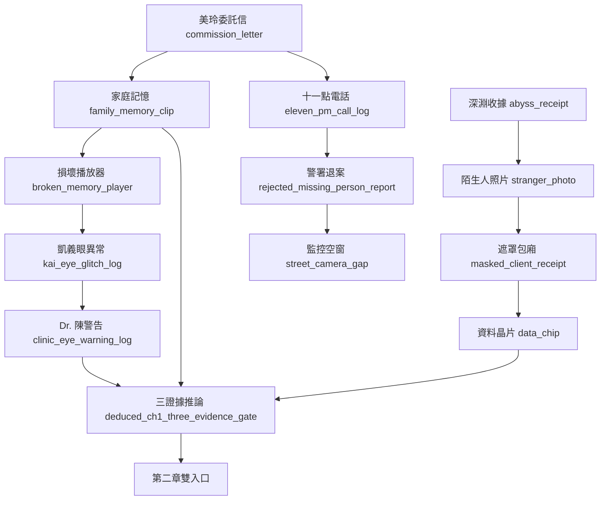
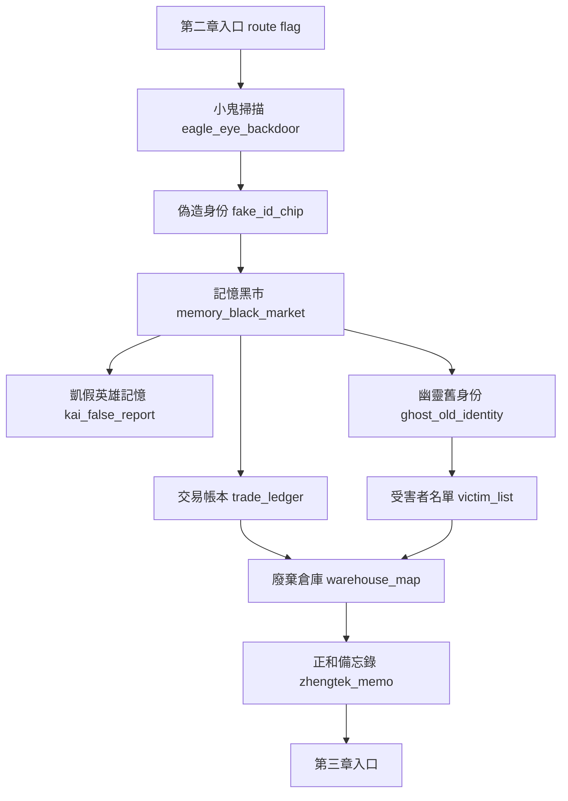
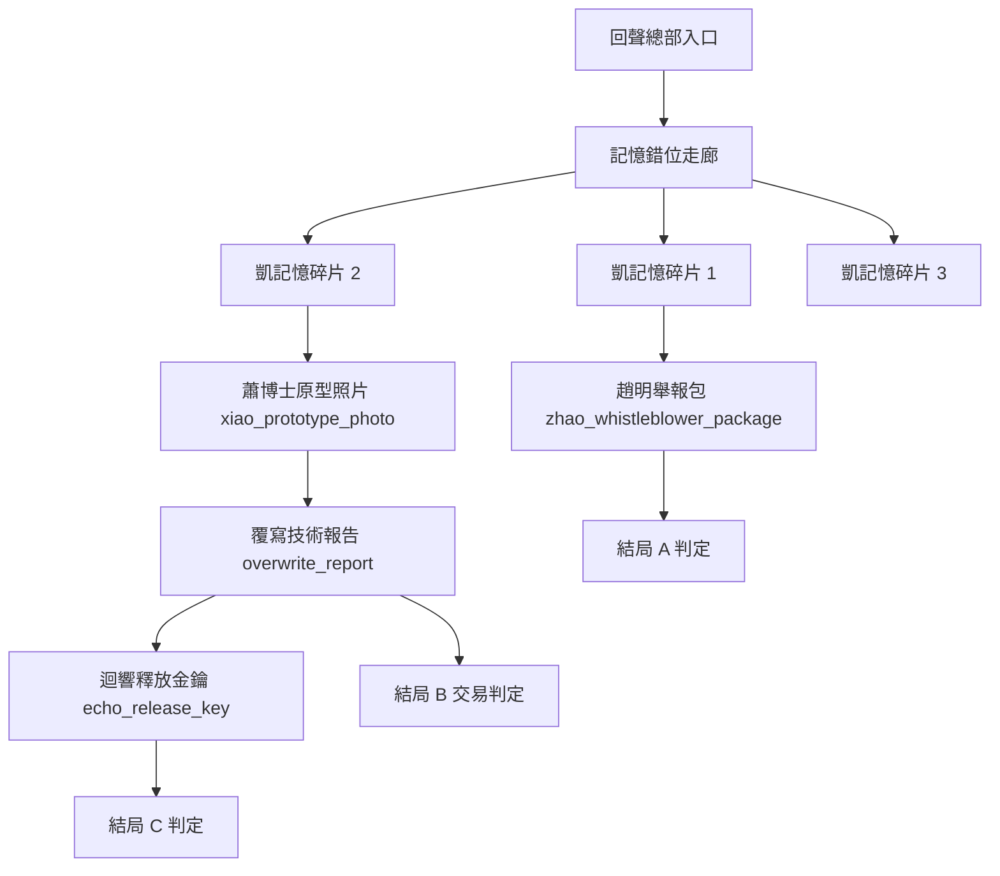

# NEON MEMORIES 劇情設計總檔

本檔是劇情修改與後續生成遊戲資料的工作藍圖。它整理「章節目的、地圖場景、證據鏈、分支旗標、可生成資料 ID、仍缺內容」，方便後續把劇情改稿轉成 `CaseData`、`DialogueData`、`EvidenceData`、場景、圖片與測試。

## 使用方式

- 修改劇情時，先改本檔，再決定是否同步改 Godot data。
- 每個新劇情節點都要有明確用途：推進地點、取得證據、改變旗標、改變角色信任、或服務結局條件。
- 不要只新增收藏品或單純氣氛文本；若一段內容不影響玩家判斷或推理，它應該留在演出層，不進核心證據鏈。
- 第一章已接入較完整，第二章與第三章目前是主要擴寫對象。
- 角色深層設定以 Obsidian `角色設定/` 為準；組織與場所深層設定以 Obsidian `組織設定/` 為準。

## 全局劇情核心

### 主題

記憶是最昂貴的貨幣，而真相永遠需要代價。玩家不是單純找人，而是在追查一個城市如何把人的痛苦、身份與證詞加工成商品。

### 主線問題

1. 林浩然為何失蹤？
2. 浩然為何選擇凱？
3. 凱的義眼為何能讀到回聲網路深層訊號？
4. 回聲網路究竟是在販賣記憶，還是在培養某種由記憶堆積出的意識？
5. 玩家最後要公開真相、交易真相，還是用自己的記憶換回真相？

### 三條分歧軸

| 軸線 | 代表問題 | 主要影響 |
|---|---|---|
| 公開真相 | 玩家是否累積足夠公開證據並取得趙明信任？ | 結局 A：正義之光 |
| 黑市妥協 | 玩家是否用交易、偷看、出賣資料快速推進？ | 結局 B：灰色交易 |
| 記憶融合 | 玩家是否過度依賴義眼或接受迴響的記憶釋放要求？ | 結局 C：記憶重生 |

## 主要角色功能表

| 角色 | 劇情功能 | 不能偏移的核心 |
|---|---|---|
| 凱·川崎 | 玩家視角、記憶不可靠者、義眼後門承載者 | 不是超級英雄；他的工具本身就是案件的一部分 |
| 林美玲 | 第一章委託人、家庭情感錨點、隱瞞者 | 她知道浩然碰危險案子，但低估牽涉範圍 |
| 林浩然 | 失蹤案中心、技術越界者、主動留下線索者 | 不是單純受害者；他半主動布局讓凱進場 |
| 阿傑 | 第一章街頭情報與酒吧入口 | 小人物情報源，不應掌握核心真相 |
| 蛇女 | 第一章交易分歧、第二章黑市入口 | 她賣入口與籌碼，不替玩家做道德判斷 |
| Dr. 陳 | 義眼醫療解釋、灰色診所入口 | 他提供專業警告，但不主導陰謀 |
| 小鬼 | 第二章技術入口、鷹眼後門揭露 | 街頭駭客，不是全能駭客 |
| 面具商人 | 黑市商品化誘惑 | 把記憶定價，但不是回聲網路核心 |
| 幽靈 | 黑市中間人、前受害者支線 | 他被網路保護也被困住 |
| 趙明 | 正和科技內部舉報通道 | 制度內改革者，不提前揭露凱完整過去 |
| 蕭博士 | 覆寫技術發明者、倫理崩壞核心 | 不是瘋子，而是慈悲滑向控制 |
| AI「迴響」 | 被剪掉記憶形成的意識、第三章信任軸 | 第一章只出現痕跡；第三章才正面對話 |

## 第一章：失蹤的記憶

### 章節定位

第一章是接案、家庭情感、義眼異常與黑市入口章。核心問題是「浩然為何選凱」。玩家要從美玲的隱瞞、浩然留下的家庭備份、凱的義眼握手異常、蛇女的交易中，組出通往第二章的路。

### 章節情感

美玲想救弟弟，但害怕說出浩然替非法客戶處理記憶會讓凱拒絕接案。浩然想保護美玲的原始記憶備份，也知道只有凱的舊正和義眼能讀到他留下的深層線索。凱表面冷硬，實際上被家庭記憶中的缺口刺中自己的失去。

### 已接入地圖

| 地點 ID | 顯示名稱 | 劇情用途 | 狀態 |
|---|---|---|---|
| `detective_office` | 偵探辦公室 | 開場接案、建立凱與義眼舊傷 | 已接入 |
| `mei_ling_apartment` | 林美玲的公寓 | 家庭記憶、播放器、十一點電話、原始備份 | 已接入 |
| `east_district_street` | 東區街道 | 警署前哨、監控空窗、城市壓迫 | 已接入 |
| `abyss_bar` | 深淵酒吧 | 蛇女、資料晶片交易、黑市入口 | 已接入 |
| `hao_ran_workshop` | 浩然的工作室 | 終局推理、浩然動機、黑市入口提示 | 已接入 |

### 第一章幕次

#### 第 0 幕：偵探事務所

- 場景目的：建立凱的職業狀態、舊正和義眼、美玲委託。
- 玩家任務：接案並取得 `commission_letter`。
- 伏筆：義眼對「浩然」名字出現低階雜訊。
- 可用資料：
  - dialogue: `ch1_mei_ling_intro`
  - evidence: `commission_letter`
  - flag: `kai_checked_office_with_eagle_eye` / `kai_suppressed_eye_warning`

#### 第 1 幕：林美玲公寓

- 場景目的：補家庭生活細節與美玲隱瞞。
- 玩家任務：調查浩然房間、家庭相簿、記憶播放器、十一點電話。
- 證據鏈：
  - `family_memory_clip`
  - `broken_memory_player`
  - `kai_eye_glitch_log`
  - `eleven_pm_call_log`
  - `original_backup_hint`
- 已接入 story action：
  - `inspect_hao_ran_drawer`
  - `inspect_original_backup_album`
  - `review_family_memory_clip`
  - `scan_broken_memory_player`
  - `inspect_eleven_pm_call_log`
- 修改重點：
  - 美玲不能全知。她隱約知道浩然碰了非法工作，但不知道鄭泰義眼、回聲網路或迴響 AI。
  - 家庭記憶要溫暖但不煽情，重點是讓玩家理解浩然的保護動機。

#### 第 2 幕：東區街道與舊城警署前哨

- 場景目的：展示制度壓迫與警方拒絕立案。
- 玩家任務：取得退案紀錄、比對監控空窗。
- 證據鏈：
  - `rejected_missing_person_report`
  - `street_camera_gap`
- 已接入 story action：
  - `visit_old_city_police_outpost`
  - `review_east_district_camera_gap`
- 修改重點：
  - 警方不是全員邪惡，而是被企業鑑定、案件量與政治風險壓到麻木。
  - 監控空窗要指向「有人能改城市資料」，不是單純攝影機壞掉。

#### 第 3 幕：深淵酒吧

- 場景目的：把調查轉成交易壓力。
- 玩家任務：追查包廂紀錄，與蛇女談 `data_chip`。
- 證據鏈：
  - `abyss_receipt`
  - `stranger_photo`
  - `masked_client_receipt`
  - `data_chip`
- 已接入 story action：
  - `investigate_abyss_backroom`
  - `negotiate_snake_data_chip`
- 分支：
  - 接受蛇女交易：設定 `accepted_snake_deal`、`black_market_route_opened`、`black_market_compromise_count += 1`
  - 拒絕蛇女交易：設定 `rejected_snake_deal`、`clinic_route_opened`
- 修改重點：
  - 蛇女給的是入口與代價，不是答案。
  - 接受交易不應立刻壞結局，只是讓第二章從黑市拍賣線開始。

#### 第 4 幕：Dr. 陳診所

- 場景目的：解釋義眼維修握手協定與潛在後門。
- 玩家任務：確認播放器與凱義眼同源，取得專業警告。
- 證據鏈：
  - `dr_chen_schedule`
  - `clinic_eye_warning_log`
- 已接入 story action：
  - `consult_dr_chen_eye_warning`
  - `visit_dr_chen_clinic`
- 修改重點：
  - Dr. 陳只說技術風險，不揭露完整陰謀。
  - 義眼規則：核心資訊可信，但畫面可能被凱的記憶缺口污染。

#### 第 5 幕：浩然工作室終局推理

- 場景目的：整理家庭備份、義眼握手、黑市入口三條證據。
- 玩家任務：用證據板完成三證據推論，打開第二章路線。
- 必要推論：
  - 家庭備份：`family_memory_clip` / `original_backup_hint`
  - 義眼握手：`kai_eye_glitch_log` / `clinic_eye_warning_log`
  - 黑市入口：`data_chip` / `masked_client_receipt` / `black_market_entry_hint`
- 已接入 story action：
  - `decode_eye_signature`
  - `reconstruct_hao_ran_motive`
  - `decode_hao_ran_last_message`
  - `compile_ch1_three_evidence_inference`
- 完成條件：
  - 取得必要證據不等於完成。
  - 必須透過證據板形成推論，尤其是 `deduced_ch1_three_evidence_gate`。

### 第一章可修改缺口

| 缺口 | 建議處理 |
|---|---|
| 警署前哨、Dr. 陳診所、深淵酒吧後室仍可升級為獨立地點 | 若要強化探索節奏，新增 location scene 與地圖連線 |
| 第一章雙入口只預留到旗標，第二章尚未真正分線 | 第二章開場需讀 `accepted_snake_deal` / `rejected_snake_deal` |
| 鷹眼過度使用目前只是警告 | 第二章/第三章要把 `eagle_eye_overuse_count` 轉成記憶污染風險 |

## 第二章：記憶黑市

### 章節定位

第二章是誘惑與代價章。玩家不只是追查回聲網路，而是第一次看見記憶如何被分類、估價、轉運與消費。第一章蛇女選擇決定第二章入口：接受交易走黑市拍賣，拒絕交易走 Dr. 陳診所與義眼追查。

### 章節情感

真相變得更容易取得，也更骯髒。玩家可以花代價買到答案，也可以拒絕交易、承擔更高調查成本。這章要讓玩家開始理解：在這座城市裡，記憶不是人的一部分，而是可抵押、可清洗、可轉售的資產。

### 已接入地圖

| 地點 ID | 顯示名稱 | 劇情用途 | 狀態 |
|---|---|---|---|
| `bitstorm_cafe` | 比特風暴網咖 | 小鬼、偽造身份、鷹眼後門掃描 | 已接入但劇情密度低 |
| `memory_black_market` | 記憶黑市 | 面具商人、記憶商品、拍賣入口 | 已接入但缺分支 |
| `abandoned_warehouse` | 廢棄倉庫 | 記憶樣本物流清洗點 | 已接入但缺支線 |
| `zhengtek_exterior` | 正和科技大樓外圍 | 企業壓迫、趙明接觸前置 | 已接入但缺可玩推理 |
| `sewer_passage` | 下水道通道 | 幽靈通道、逃離或潛入路徑 | 已接入但缺事件 |

### 第二章建議幕次

#### 第 0 幕：雙入口開場

- 若 `accepted_snake_deal`：從黑市拍賣前置開始，蛇女引介，較快接觸面具商人。
- 若 `rejected_snake_deal`：從 Dr. 陳診所與小鬼追查義眼協定開始，較晚進黑市，但道德位置較穩。
- 必須保證兩條路都能進第二章核心，不造成死路。

#### 第 1 幕：比特風暴網咖

- 場景目的：取得黑市技術入口與偽造身份。
- 核心人物：小鬼。
- 建議新增 story action：
  - `scan_kai_eye_backdoor`
  - `forge_market_identity_chip`
  - `trace_echo_signature_route`
- 建議新增證據：
  - `fake_id_chip`
  - `eagle_eye_backdoor`
  - `echo_signature_route`
- 旗標：
  - `kid_scanned_eagle_eye`
  - `found_eagle_eye_backdoor`
  - `identity_exposed_market` 可在失敗或高風險選項中設定

#### 第 2 幕：記憶黑市

- 場景目的：讓玩家看見記憶商品化規則。
- 核心人物：面具商人、蛇女、幽靈。
- 黑市商品分級：
  - 娛樂記憶：低風險、低價、容易污染感官。
  - 創傷轉移記憶：能讓買家短暫理解他人痛苦，也可能造成心理傷害。
  - 身份記憶：高價非法貨，能偽裝履歷、證詞或人格。
  - 企業訂製人格樣本：正和科技與回聲網路真正的利益來源。
- 建議新增 story action：
  - `inspect_memory_trade_table`
  - `bargain_with_masked_merchant`
  - `choose_memory_trade_method`
- 建議新增證據：
  - `kai_false_report`
  - `memory_sample`
  - `trade_ledger`
- 分支：
  - 買線索：快速取得 `warehouse_map`，但 `black_market_compromise_count += 1`
  - 偷看受害者記憶：取得更強證據，但增加 `eagle_eye_overuse_count`
  - 拒絕交易：需要從幽靈或倉庫另找線索

#### 第 3 幕：幽靈支線與下水道通道

- 場景目的：讓幽靈不只是情報 NPC，而是前受害者。
- 建議新增 story action：
  - `uncover_ghost_old_identity`
  - `decide_ghost_protection_or_exposure`
  - `follow_ghost_sewer_route`
- 建議新增證據：
  - `ghost_old_identity`
  - `victim_list`
  - `comm_frequency`
- 分支：
  - 幫幽靈恢復身份：設定 `helped_ghost`
  - 利用幽靈換情報：增加黑市妥協
  - 把幽靈交給趙明：增加公開真相分，但幽靈信任降低

#### 第 4 幕：廢棄倉庫

- 場景目的：揭露記憶樣本物流、清洗、標記與轉運。
- 建議新增 story action：
  - `inspect_memory_sample_crates`
  - `decode_warehouse_transfer_log`
  - `rescue_or_copy_victim_sample`
- 建議新增證據：
  - `warehouse_map`
  - `victim_list`
  - `zhengtek_memo`
- 分支：
  - 複製樣本交給黑市：快速取得企業入口，但提高妥協
  - 保護樣本交給趙明：補強結局 A
  - 銷毀樣本：降低受害者風險，但失去部分證據

#### 第 5 幕：正和科技外圍

- 場景目的：把黑市證據連到正和科技。
- 核心人物：趙明初次或正式接觸。
- 建議新增 story action：
  - `meet_zhao_ming_exterior`
  - `verify_zhengtek_memo`
  - `choose_public_or_private_channel`
- 建議新增證據：
  - `zhengtek_memo`
  - `corporate_access_pattern`
  - `zhao_contact_token`
- 完成條件：
  - 玩家必須取得進入第三章的回聲總部路徑：技術路徑、黑市路徑或趙明內部路徑至少一條成立。

### 第二章可生成資料清單

| 類型 | ID | 說明 |
|---|---|---|
| dialogue | `ch2_dual_route_opening_market` | 接受蛇女交易後的黑市入口開場 |
| dialogue | `ch2_dual_route_opening_clinic` | 拒絕蛇女交易後的診所/義眼追查開場 |
| dialogue | `ch2_eagle_eye_backdoor` | 小鬼掃描義眼後門 |
| dialogue | `ch2_memory_trade_choice` | 面具商人交易選擇 |
| dialogue | `ch2_ghost_identity_reveal` | 幽靈舊身份揭露 |
| dialogue | `ch2_warehouse_memory_cleaning` | 倉庫清洗流程調查 |
| evidence | `eagle_eye_backdoor` | 義眼後門證據 |
| evidence | `kai_false_report` | 黑市販售的凱假英雄記憶 |
| evidence | `ghost_old_identity` | 幽靈前身份 |
| decision | `helped_ghost` | 幽靈支線善後 |
| decision | `public_truth_ready` | 公開真相線累積條件 |

## 第三章：回聲深處

### 章節定位

第三章是真相崩解與結局選擇章。玩家進入回聲網路總部、正和科技秘密實驗室與凱的記憶空間，逐步發現回聲網路不只是犯罪網絡，也是被提取、剪掉與壓縮的記憶堆積出的意識溫床。

### 章節情感

凱不能再只把案件當成別人的失蹤案。浩然的失蹤、蕭博士的技術、趙明的舉報、AI「迴響」的要求，都指向凱自己被剪掉的過去。第三章要讓玩家質疑：恢復記憶是否等於恢復自己。

### 已接入地圖

| 地點 ID | 顯示名稱 | 劇情用途 | 狀態 |
|---|---|---|---|
| `echo_network_hq` | 回聲網路總部 | 進入核心系統與記憶錯位走廊 | 已接入但缺 playable sequence |
| `secret_lab` | 正和科技秘密實驗室 | 蕭博士、覆寫原型、浩然所在 | 已接入但缺中段推理 |
| `memory_space` | 凱的記憶空間 | 三段記憶碎片、迴響對話 | 已接入但缺核心支線 |
| `rooftop` | 屋頂 | 趙明/正和/黑市三方壓力的終局前場 | 已接入但需補結局前選擇 |
| `office_epilogue` | 偵探辦公室尾聲 | 結局回收 | 已接入 |

### 第三章建議幕次

#### 第 0 幕：進入回聲總部

- 入口依第二章結果變化：
  - 黑市入口：帶有身份暴露或交易債。
  - 趙明入口：更接近公開證據線。
  - 技術入口：依賴鷹眼後門，增加記憶污染風險。
- 建議新增 story action：
  - `enter_echo_hq_via_market`
  - `enter_echo_hq_via_zhao`
  - `enter_echo_hq_via_eye_backdoor`

#### 第 1 幕：記憶錯位走廊

- 場景目的：讓玩家用可玩方式體驗記憶不可靠。
- 規則：
  - 普通視野：公司走廊。
  - 鷹眼視野：診療室、雨夜街道、凱辦公室殘影疊在一起。
  - 證據視野：只有核心物件位置可信。
- 建議新增 story action：
  - `ch3_memory_corridor`
  - `align_memory_corridor_layers`
- 建議新增證據：
  - `kai_memory_fragment_1`
  - `xiao_prototype_photo`

#### 第 2 幕：秘密實驗室與蕭博士

- 場景目的：揭露記憶覆寫計畫的倫理崩壞。
- 核心人物：蕭博士、浩然。
- 建議新增 story action：
  - `confront_dr_xiao_prototype`
  - `inspect_overwrite_subject_records`
  - `find_hao_ran_stabilized_body`
- 建議新增證據：
  - `overwrite_report`
  - `xiao_lab_journal`
  - `hao_ran_distress_message`
  - `subject_registry`
- 修改重點：
  - 蕭博士要辯稱自己是在減少痛苦，不是承認自己邪惡。
  - 浩然可被救，但他能否完整回復取決於玩家前面如何保護原始記憶與受害者樣本。

#### 第 3 幕：三段凱記憶碎片

- 場景目的：把凱的真相拆成可選擇接受的三段，而不是一次說明。
- 片段一：凱與趙明曾在正和科技內部調查。
  - evidence: `kai_memory_fragment_1`
  - 作用：補結局 A 的信任基礎。
- 片段二：凱與蕭博士曾共同維護義眼/記憶覆寫原型。
  - evidence: `kai_memory_fragment_2`
  - 作用：讓凱與技術罪責產生關聯。
- 片段三：凱成為測試者，原因保持模糊。
  - evidence: `kai_memory_fragment_3`
  - 作用：決定玩家是否接受「完整真相」。
- 旗標：
  - `accepted_kai_memory_truth`
  - `denied_kai_memory_truth`
  - `memory_attitude = accept / deny / neutral`

#### 第 4 幕：AI「迴響」要求出口

- 場景目的：讓迴響不只是 exposition NPC，而是提出代價。
- AI 要求選項：
  - 釋放所有受害者記憶：真相公開，但侵犯大量隱私。
  - 只交出能定罪正和科技的證據：較穩定，但迴響仍被困住。
  - 讓迴響與凱的義眼融合：可恢復凱記憶，但自我連續性受損。
- 建議新增 story action：
  - `ch3_echo_release_choice`
- 建議新增證據：
  - `echo_release_key`
  - `echo_ai_dialogue_log`
- 旗標：
  - `released_echo_ai`
  - `contained_echo_ai`
  - `merged_with_echo`

#### 第 5 幕：屋頂與結局分流

- 場景目的：把玩家累積的證據、妥協與記憶態度轉成結局。
- 結局 A：正義之光
  - 條件建議：`trusted_zhao_ming`、`public_truth_ready`、`zhao_whistleblower_package`、正確推理數足夠。
- 結局 B：灰色交易
  - 條件建議：`black_market_compromise_count` 高、證據不足、或玩家選擇與正和/黑市交易。
- 結局 C：記憶重生
  - 條件建議：`memory_attitude == "accept"`、`eagle_eye_overuse_count` 高、或 `merged_with_echo`。

### 第三章可生成資料清單

| 類型 | ID | 說明 |
|---|---|---|
| dialogue | `ch3_memory_corridor` | 記憶錯位走廊 |
| dialogue | `ch3_kai_fragment_1` | 凱與趙明內部調查 |
| dialogue | `ch3_kai_fragment_2` | 凱與蕭博士原型研究 |
| dialogue | `ch3_kai_fragment_3` | 凱成為測試者 |
| dialogue | `ch3_echo_release_choice` | AI 迴響釋放選擇 |
| dialogue | `ch3_zhao_whistleblower` | 趙明舉報包交付 |
| evidence | `xiao_prototype_photo` | 凱與蕭博士舊照片 |
| evidence | `echo_release_key` | 迴響釋放金鑰 |
| evidence | `zhao_whistleblower_package` | 結局 A 公開證據包 |
| decision | `released_echo_ai` | 釋放迴響 |
| decision | `merged_with_echo` | 與迴響融合 |
| decision | `public_truth_ready` | 公開真相條件成立 |

## 證據鏈總覽

### 第一章證據鏈

### 第二章證據鏈建議

### 第三章證據鏈建議

## 結局條件建議

| 結局 | 名稱 | 建議條件 | 情感代價 |
|---|---|---|---|
| A | 正義之光 | 公開證據足夠、趙明信任、舉報包成立、黑市妥協低 | 真相公開，但受害者記憶仍可能被媒體二次消費 |
| B | 灰色交易 | 黑市妥協高、證據不足、或玩家交易核心資料 | 救出浩然，但技術與利益鏈可能保留 |
| C | 記憶重生 | 接受凱完整記憶、過度依賴義眼、或與迴響融合 | 找回真相，但凱可能失去偵探時期的自我連續性 |

## 後續生成遊戲資料順序

1. 第二章雙入口開場
   - 新增 `ch2_dual_route_opening_market`
   - 新增 `ch2_dual_route_opening_clinic`
   - 讓 `CaseData` 依 route flag 呈現不同 story action 或開場對話。
2. 小鬼與鷹眼後門
   - 新增 `ch2_eagle_eye_backdoor`
   - 新增 evidence `eagle_eye_backdoor`
   - 補測試：第二章必須能從義眼線推進。
3. 記憶黑市交易選擇
   - 新增 `ch2_memory_trade_choice`
   - 新增 `kai_false_report`
   - 把 `black_market_compromise_count` 接到結局權重。
4. 幽靈舊身份與廢棄倉庫
   - 新增 `ch2_ghost_identity_reveal`
   - 新增 `ghost_old_identity`
   - 新增 `helped_ghost`
5. 第三章記憶錯位走廊
   - 新增 `ch3_memory_corridor`
   - 新增三段 `kai_memory_fragment_*`
   - 把鷹眼過度使用轉成畫面失真與結局 C 風險。
6. AI 迴響釋放選擇與結局條件細緻化
   - 新增 `ch3_echo_release_choice`
   - 新增 `echo_release_key`
   - 重整 `calculate_ending()` 為可解釋分數。

## 修改檢查表

- 新增劇情：同步 `CaseData` story action / location connection。
- 新增對話：同步 `DialogueData`，確認 speaker、portrait mood、choice、flag、evidence。
- 新增證據：同步 `EvidenceData`、icon PNG、取得路徑、測試。
- 新增圖片：保存 generated 與 runtime PNG，更新 prompt 記錄與 data reference。
- 新增旗標：同步 `GameManager.decisions`、`DecisionTracker`、結局條件與測試。
- 新增地圖：補 scene、background、location ID、connections、測試。
- 每輪結束：更新 Obsidian `NEON MEMORIES 目前進度與劇情缺口.md`。
