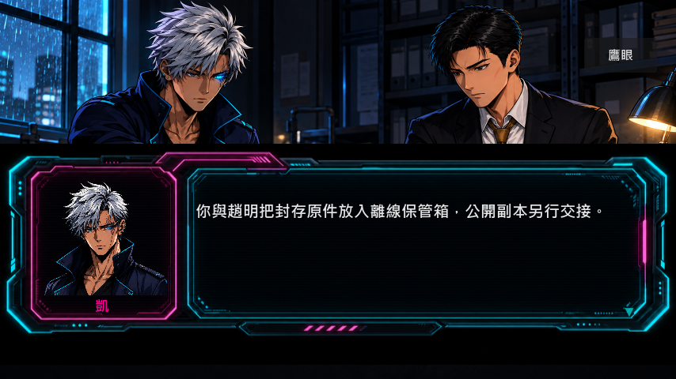

# 第一批劇情延伸：幽靈、總部入口與公開結局

2026-09-08。本輪完成延伸規劃中的 P1；P2／P3 尚未實作。新增 5 段可操作對話、2 項證據、2 張物品圖與 1 張結局 CG。正式證據由 37 項增加至 39 項；主結局仍為 A／B／C，A 新增共同作證與帶罪揭露兩種結果。

## 如何遊玩新內容

1. 第二章完成倉庫調查後，回下水道，選「比對幽靈的採樣時間與身份使用紀錄」。採樣時間與出勤矛盾，需要核對獨立終端摘要，不能直接指認幽靈。誤判可以回查，不會卡關。
2. 決定保護或出賣幽靈後，選「回到離線頻道，處理對幽靈的承諾」。保護可取得接應器；出賣後可註銷企業通行資格，換取有限接應，也能拒絕補救。註銷捷徑不刪除帳本或交易證據，不重設妥協次數，更不等於原諒。
3. 第三章在總部前室選進入方式：幽靈接應、身份交易的企業通行，或自行比對排程。尚未選定入口時不能直接比對內部走廊；錯誤訊號與中途取消都可重試。沒有做幽靈支線仍有自行調查的入口。
4. 準備公開案件時，在總部完成「核對三份原件與獨立稽核紀錄」及「確認或更新自己的行動紀錄」。後者逐項顯示實際交易、身份使用與私人記憶外流；若後來釋放迴響，必須回來更新紀錄。
5. 救援、對質、核心證據與趙明舉報包完成後，到屋頂選公開。無額外交易／外流紀錄呈現「共同作證」；有相關紀錄且完成補證與揭露，呈現「帶罪揭露」。不再因黑市妥協超過一次直接阻擋公開。

第二章地圖會提醒未完成的幽靈約定；提醒不增加倒數或強迫解支線。幽靈接應會在浩然救援段落回收，補救者的尾聲也與拒絕者區分。受害者隱私外流的舊後果繼續保留。

## 分支規則與保存

| 選擇 | 後續可玩影響 | 保留的代價 |
|---|---|---|
| 保護＋回訪 | 取得接應器，核對暗號後走維修門 | 接應只限本次，不是全面作證承諾 |
| 出賣＋補救 | 註銷企業捷徑，改得有限接應 | 身份外流、原始交易、幽靈拒絕作證仍保留 |
| 出賣＋拒絕補救／未回訪 | 可選企業身份通行，也可自行查排程 | 使用身份會新增一筆需揭露的出勤紀錄 |
| 跳過支線 | 自行核對排程，仍能通關 | 沒有幽靈接應，自己記住撤離方式 |

- 新對話：ch2_ghost_trace、ch2_ghost_followup、ch3_hq_entry、ch3_verify_public_sources、ch3_review_public_record。
- 新證據：ghost_identity_trace、ghost_relay_token；在既有證據介面顯示，不新增獨立背包系統。
- 新保存欄位：ghost_followup_choice、hq_entry_route、public_record_reviewed、public_record_facts、public_ending_variant；其餘推進使用既有旗標機制。
- 共用 GameManager 條件檢查支援公開責任分支；行動紀錄確認會保存當下清單，與最新狀態比較。黑市次數保留為歷史紀錄，舊檔缺少細節時仍須交代，不作不可修復的次數門檻。
- A 結局播放完成後保存 joint／accountable 子結果，回顧依已保存子結果顯示。最終選擇後禁止再改迴響處置，避免讓已選結局失效。
- 舊存檔缺少欄位會補預設；舊的「已選公開、尚未結案」若不符合新增核驗條件，重新開放最後選擇，可回總部補做。已結案的舊檔保留原結局。

## 已交付素材

| 素材 | 遊戲路徑 | 規格 |
|---|---|---|
| 身份轉用核對紀錄 | assets/sprites/items/ghost_identity_trace.png | 512×512 RGBA，四角全透明，156,472 個透明像素 |
| 幽靈接應器 | assets/sprites/items/ghost_relay_token.png | 512×512 RGBA，四角全透明，169,940 個透明像素 |
| 公開證據交接 CG | assets/sprites/cg/cg_public_evidence_handover.png | 1920×1080 不透明 RGB；依凱與趙明現行立繪生成 |

使用 built-in image_gen。兩張物品原圖及 CG 原圖／構圖修正版均保留在 assets/generated/對應類別/raw/；處理後來源存於 assets/generated/對應類別/，與 runtime 指紋一致。CG 初稿的交接動作會被對話框遮住，已生成修正版調高動作，保留首次原圖，不覆寫人物立繪。

完整提示詞、生成前規格、修正提示詞、來源路徑與指紋：[素材製作紀錄](../assets/generated/prompts/image_gen_story_expansion_2026_09_08.jsonl)。總清單 assets/asset_manifest.json 已更新為 141 筆（138 張圖片＋3 首配樂）；106 張圖片有獨立原圖紀錄，32 張舊素材的追溯缺口維持原狀。四段短音效仍未交付，本輪沒有重新採用被否決的音效。

## 顯示修正

實際截圖發現高解析 CG 會把 TextureRect 撐成原圖尺寸，導致人物被裁切。兩個 CG 顯示入口均改成忽略原圖最小尺寸，由 viewport 決定範圍；對話 CG 使用完整不透明顯示。共用載入與透明缺檔處理保留。

GPU 實際渲染已核對桌面、手機模擬與 854×480 小螢幕。新選項可完整顯示，CG 中人物與證據交接不被裁切；這是桌機模擬尺寸，尚未替代實體手機驗收。

## 驗證

完整檢查 923 通過、0 失敗、0 警告；四條真實新遊戲通關涵蓋 A1／A2 與三種入口，舊檔與行動紀錄回歸通過；GPU 對話／CG 顯示 147 項通過。

- 四條真實新遊戲路線：A1 保護／接應，A2 購買＋出賣後補救＋釋放迴響再補述，B 企業入口，C 跳過回訪、自行核對入口。不是直接注入狀態冒充通關。
- 負例包含誤判／取消不授予結果、一次性獎勵、補救不清除傷害、註銷企業入口、資料外流後須更新聲明、結局前置條件、舊檔、存讀檔及 27 種既有家庭尾聲組合。
- GPU 對話／CG 顯示：147 項通過，涵蓋七段對話與三種尺寸；截圖採隔離 UI 測試場景，不能當成實際路線位置的截圖。
- 素材核對：141 筆、0 路徑或指紋錯誤；Godot 編輯器匯入無 ERROR／SCRIPT ERROR；git diff --check 通過。
- 靜態劇情檢查 PROGRESS_SCORE=851，這是檢查分數，不是遊戲完成百分比。

證據與截圖保存在 docs/verification/story_p1_2026_09_08/。測試在 tests/test_playthrough.gd、tests/test_dialogue_layout.gd，完整入口 tests/test_data_integrity.py 已標記對應 Bug regression。

## 剩餘範圍與下一步

P2：蛇女追討報價權、浩然未寄出的備份、蕭博士證據對質與三段記憶交叉核對，尚未製作。P3：B／C 的兩種結果與其餘兩張 CG 尚未製作。可選五張加強美術、四段既有短音效與兩段延伸短音效也未交付。

下一步先實玩 P1 的選擇節奏，再依既有規劃製作 P2 的蛇女債務線；必須區分第一章晶片交易與第二章市場報價權的債主，不能把未欠債的玩家寫成有債。專案與 Obsidian 已同步本輪完成範圍。沒有 commit 或 push。
