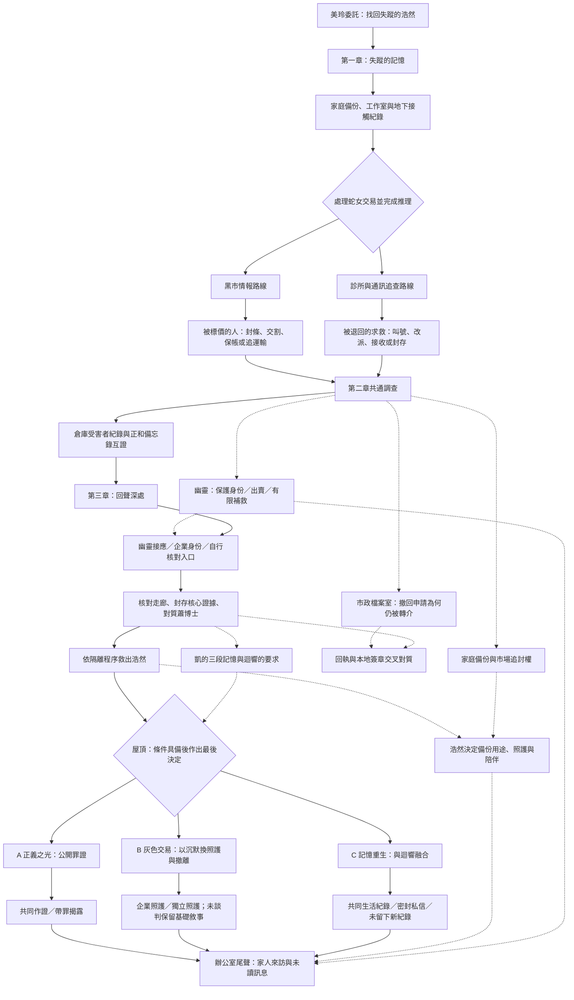
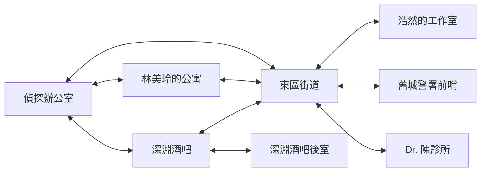
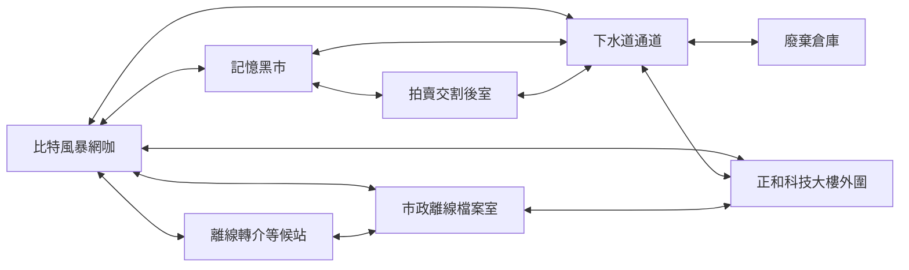
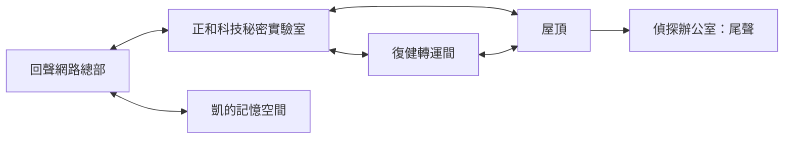

# NEON MEMORIES｜目前劇情架構圖

核對日期：2026-09-09。包含全部劇透。依目前遊戲資料與結局判定整理；人物內心補充另見 [人物設定總覽](./character_profiles_2026_09_09.md)。

## 故事核心

近未來的九龍延伸區，記憶可以被修復，也可以被買賣、改寫。失憶偵探凱接下林美玲的尋弟委託，沿著家庭備份、地下交易與企業紀錄找到浩然，卻發現自己同時是調查者、原型維護者與被覆寫的人。

玩家最後選擇的不只是如何處理企業罪證，也包括：願意為找人付出誰的代價，以及還要不要找回可能取代現在自己的舊記憶。

## 一、全局劇情圖

實線表示主要推進；虛線表示可選支線的影響。這是敘事結構，不是每一項操作都必須依圖上的先後完成。

**三個主結局不等於七個完全獨立結局。** A 的兩種表現、B 的照護差異與 C 的甦醒回應，共用各自主結局。前輪七條通關驗證涵蓋 A1／A2、B 兩種照護、C 共同紀錄／私信／略過；不是所有支線組合的窮舉。

## 二、每章的問題與推進

| 章節 | 玩家開始時的問題 | 本章揭露 | 進入下一段所需 |
|---|---|---|---|
| 一：失蹤的記憶 | 浩然為什麼沒有回家？美玲隱瞞了什麼？ | 家庭原始備份、灰色工作與鷹眼握手把失蹤案連到記憶供應鏈 | 完成第一章推理、處理蛇女交易立場，再由地圖確認前往第二章 |
| 二：記憶黑市 | 記憶如何從生活變成商品？浩然被送往哪裡？ | 倉庫受害者清單、浩然日記與企業備忘錄互證；幽靈也是曾被提取的人 | 新遊戲另須完成醫療／市場線交接；完成倉庫調查與備忘錄核對，回網咖確認總部路線，再前往第三章 |
| 三：回聲深處 | 誰決定繼續覆寫？凱以前做過什麼？ | 核心原件、蕭博士、凱的維護與測試經歷，以及迴響的自由要求 | 安全救援、共同核心證據條件，加上各結局專屬條件；在屋頂確認與執行 |

行動點耗盡不是自動完成章節；新支線也不是每一條都必做。

## 三、目前地圖連線：22 個地點

以下連線取自目前地圖資料。雙向線代表相互連接；解鎖仍受劇情條件限制。辦公室與尾聲辦公室是兩個不同的遊戲地點。

### 第一章：8 個地點

### 第二章：8 個地點

### 第三章：6 個地點

實驗室與記憶空間在走廊核對後開放；復健轉運間需先救出浩然；尾聲辦公室需完成結局。第一、二章的地點不能因為保存了掃描紀錄就跨章返回。

## 四、重要選擇如何回收

| 選擇線 | 目前可選內容 | 後續影響 |
|---|---|---|
| 蛇女晶片交易 | 接受或拒絕交易 | 第一章出口敘事、第二章開場與公開行動紀錄 |
| 阿傑口供 | 自願核對／施壓指認／不用證詞；可更正施壓 | 證詞可信度與 A 公開責任；更正不抹除曾經施壓 |
| 記憶交易 | 購買／侵入／拒絕 | 資料與身份追蹤代價；不能把所有交易混成同一筆債 |
| 幽靈身份 | 保護／出賣／暫緩；出賣後可註銷企業捷徑補救 | 總部入口、救援接應、證詞與尾聲；補救不等於取得原諒 |
| 未寄出備份 | 封存／複製／不保留；救援後再問本人 | 浩然授權用途、私人副本處置、A 的行動紀錄 |
| 市場追討權 | 處理報價與追討範圍，或以聯絡路由換條件 | B 照護談判與新增的隱私代價 |
| 東區時鐘 | 分列時間來源／先保留人為假設 | 檔案室回應玩家是否過早推論 |
| 倉庫批號 | 優先接收代碼／優先運送封條 | 其他受害者照護查詢或設備流向，回收到轉運間與尾聲 |
| 後門出貨紀錄 | 完整序號封存／先發去識別摘要 | 趙明的核驗說明與接收單位反應 |
| 市政撤回回執 | 暫停錯誤轉介／用無真人資料的測試碼追站 | 蕭博士對質與 A 後續調查；匿名 R-17 不直接等同浩然 |
| 蕭博士再次對質 | 用完整時間鏈追問／保留爭議；只拿資金指認會被反駁 | 承認收到撤回後仍寫入，或明列未證實部分；不取代三份核心原件 |
| 浩然救援後 | 照護／有限證言、紙本／指定醫師交接、陪伴／留空間 | B 與家人尾聲；醫療交接方式不會自動取消企業交易條件 |
| 迴響 | 離線封存／全部釋放／同意融合 | 自由、隱私外流與 C 的資格；釋放不是安全公開證據的捷徑 |
| 甦醒紀錄 | 與美玲共同核對／密封私信／略過 | C 甦醒後的敘事；不是保證人格不變的道具 |

十處耗能掃描的觀察可在「已保存的鷹眼紀錄」回看。它保存已取得的觀察，不替玩家自動選分支。

## 五、結局條件與代價

**所有主結局共同要求：** 第三章、完成蕭博士初次對質、安全救出浩然、封存核心證據，並持有記憶覆寫技術報告、正和科技資金流向、高層授權令。完成調查後仍要在屋頂主動選擇結局。

| 主結局 | 額外條件 | 主要結果與代價 |
|---|---|---|
| A 正義之光 | 信任趙明、確認公開證據鏈、完成保護證人身份的舉報包、核對三份原件與獨立稽核紀錄，並確認與當前行動一致的最新自述紀錄 | 公開企業罪證；沒有需補列責任時呈現共同作證，有交易／資料處置責任時呈現帶罪揭露。做過錯事不會直接永久鎖死 A，但不能隱瞞 |
| B 灰色交易 | 沒有另加市場交易或照護談判的硬門檻 | 以沉默與核心證據換取後續照護、撤離與金錢；浩然先被救出，並非拿交易取代救援。若談好條款，呈現企業或獨立照護差異 |
| C 記憶重生 | 核對三段記憶、回應迴響、接受恢復並同意融合；最後在屋頂選擇記憶恢復 | 找回舊記憶，但偵探時期的自我連續性受到破壞；罪證另存。前面同意融合仍可在最後改選 A 或 B |

凱的三段記憶依序揭露：**調查者 → 原型維護者 → 簽名後又喊停的測試者**。受害經驗不取消他的參與責任，曾經簽名也不取消後來撤回的權利。

## 六、已接入與仍待深化

已接入三章、22 地點、39 項正式證據、12 處耗能掃描、29 項證據補充讀取，以及上表的分支與尾聲回應。

仍待深化：蕭博士多輪證據對質、三段記憶互相矛盾的完整推理、更多舊地圖可點物件、生物指標審訊、B／C 新 CG。人物筆記中的可能背景與未採用支線不算現行遊戲事件。

## 核對依據

- `scripts/data/case_data.gd`：章名、地點、連線、調查前提。
- `scripts/data/dialogue_data.gd`：各章對話、選擇、結局與尾聲。
- `scripts/core/game_manager.gd` 的 `get_ending_requirements()`、`calculate_ending()`：實際結局條件。
- `docs/scan_maps_expansion_2026_09_08.md`：上一輪交付範圍。
- Obsidian 的「時代與故事背景」「NEON MEMORIES 目前進度與劇情缺口」：世界觀與現況對照。

2026-09-09 製作更新：加入第二章兩條調查線，各三事件；共 22 地點、53 條有向連線。完整驗收以 [本批製作紀錄](./chapter_branches_completed_2026_09_09.md) 為準。第三章兩種局面的完整擴充仍是下一批。
